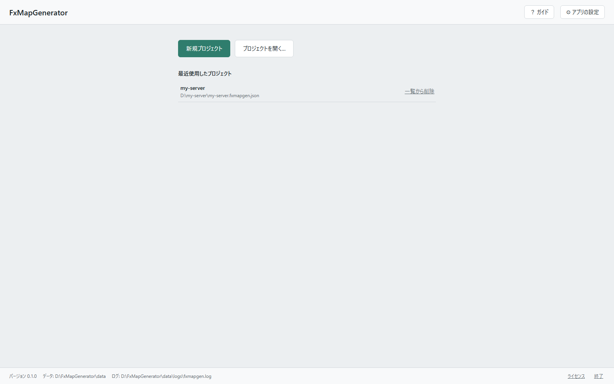
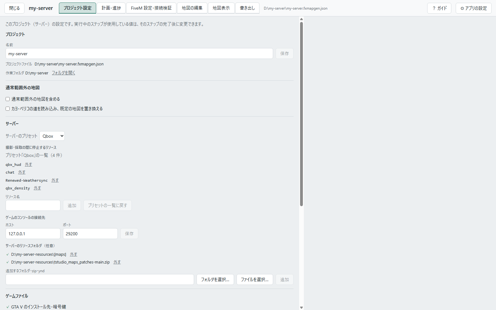
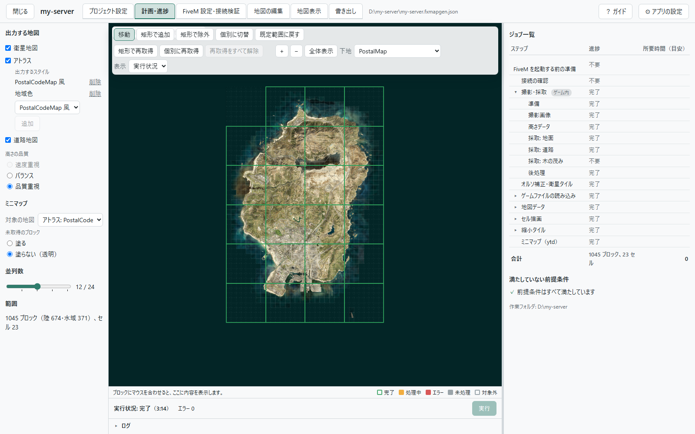
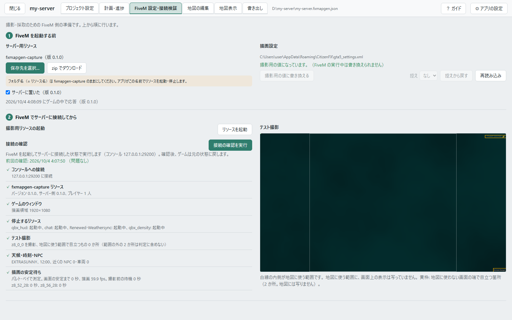
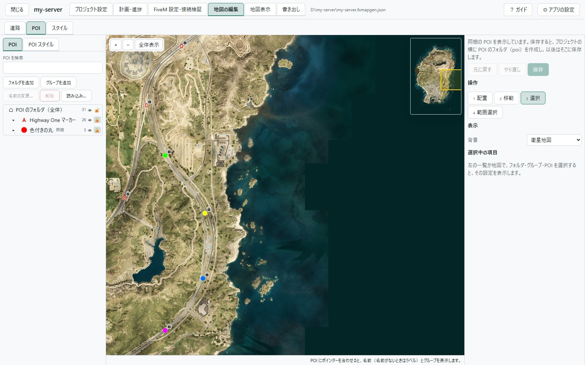
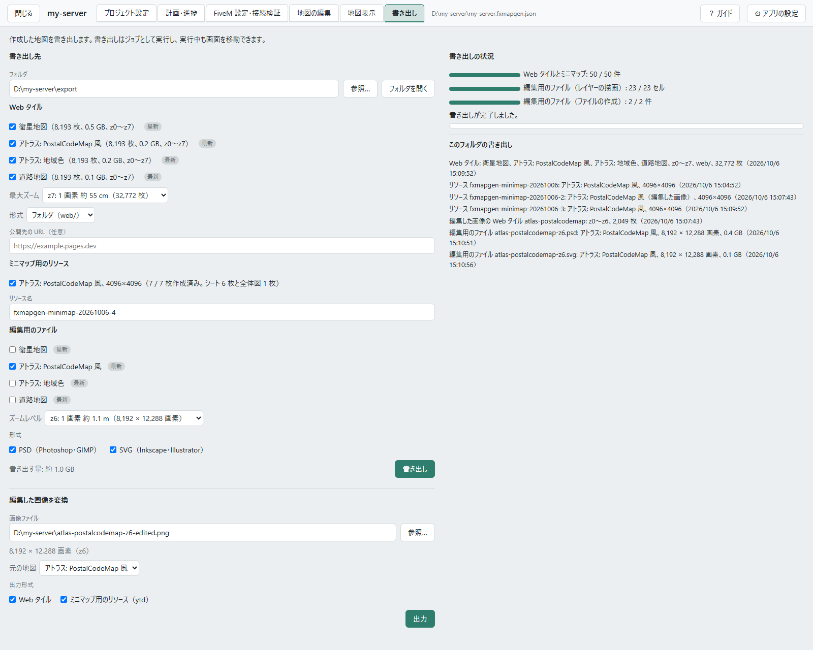

# 画面ごとの説明

[English](screens.md) | 日本語

それぞれの画面で何をするかと、画面の主な所の説明です。地図を作る手順は [はじめての地図](walkthrough.ja.md)、
やりたいことからの手順と困ったときの対処は [よくある質問](faq.ja.md) にあります。

画面にも説明があります。

- **ガイド**: 上の帯の「？ ガイド」を押すと、その画面の主な所を順に明るくして、吹き出しで説明します。画面を初めて
  開いたときにも、表示するかを聞きます。
- **解説**: 項目にマウスを乗せると、その項目の解説が出ます。押せないボタンには、押せない理由が出ます。

| 画面 | すること |
|---|---|
| [スタート画面](#スタート画面) | プロジェクトを作る、開く。アプリの設定 |
| [プロジェクト設定](#プロジェクト設定) | サーバー、通常の地図の外、ラベルなど、プロジェクトの設定 |
| [計画・進捗](#計画進捗) | 作る地図と範囲を決めて、実行する |
| [FiveM 設定・接続検証](#fivem-設定接続検証) | 撮影用リソースの配置、描画設定、接続の確認 |
| [地図の編集](#地図の編集) | 道路、POI、スタイルを直す |
| [地図表示](#地図表示) | 作成した地図を見る |
| [書き出し](#書き出し) | Web タイル、ミニマップ用のリソース、編集用のファイルを書き出す。編集した画像を変換する |

## スタート画面

exe を起動すると、最初に開く画面です。

  

  

- **新規プロジェクト**: プロジェクト名、プロジェクトファイル（`.fxmapgen.json`）の保存先、作業フォルダ、サーバーの
  プリセット、出力する地図を決めて、プロジェクトを作成します。どれも後から変更できます。作業フォルダには、撮影画像・
  採取データ・タイルなど、大きなデータ（全域で 10 GB 前後）を置きます。
- **プロジェクトを開く…**: 保存済みのプロジェクトファイルを開きます。
- **最近使用したプロジェクト**: 開いたことのあるプロジェクトが、新しい順に 10 件まで並びます。「一覧から削除」は一覧から
  外すだけで、ファイルは削除しません。
- **実行中のジョブ**: ジョブの実行中は、実行しているプロジェクトが出ます。「このプロジェクトを開く」で戻れます。
- **⚙ アプリの設定**: 画面の表示言語、配色（ライト・ダーク）、GTA V と暗号鍵の場所です。この PC のすべての
  プロジェクトで共通です。GTA V と暗号鍵の場所は、空欄なら自動で検出します。
- **画面の下**: 設定とログの場所（`%LOCALAPPDATA%\FxMapGenerator`）、ライセンス、「終了」があります。ブラウザのタブを
  閉じても、アプリと実行中のジョブは動き続けます。アプリを終了するのは「終了」です（ジョブの実行中は、即時停止してから
  終了します）。

プロジェクトを開くと、上の帯にタブが出ます。満たしていない前提条件のあるタブには、✗ と数が付きます。「閉じる」で
スタート画面に戻ります（ジョブの実行中でも、実行は続きます）。

## プロジェクト設定

このプロジェクト（サーバー）の設定です。項目ごとに、確認の結果（✓ / ✗）が出ます。

  

- **プロジェクト**: 名前、プロジェクトファイル、作業フォルダです。作業フォルダは「フォルダを開く」で開けます。
- **通常範囲外の地図**: GTA V の通常の地図の外（カヨ・ペリコなど）も地図にするときに、上下左右にセルを足します
  （[よくある質問](faq.ja.md#カヨペリコや-roxwood-も地図にするには)）。
- **サーバー**: サーバーのプリセット（Qbox・QBCore）、「撮影・採取の間に停止するリソース」（HUD・通知・チャットなど、
  写真に写るものや描画に影響するもの。終わると起動し直します）、ゲームのコンソールの接続先（通常は
  `127.0.0.1:29200` のまま）です。ゲームのコンソールは、FiveM クライアントのコンソール（ゲームの中で F8 で
  開くもの）です。サーバーのコンソールではありません。アプリは、これを通してゲームを操作します。
- **サーバーのリソースフォルダ**: サーバーが独自の道路データ（`.ynd`）を配布しているときに、そのリソースのフォルダ・
  zip・ynd を指定します（任意）。サーバーが起動する順に追加します。同じ区画は、後に指定したものを優先します。
- **ゲームファイル**: アトラスと道路地図、ミニマップ用のリソースの書き出しが読む、GTA V と暗号鍵の場所です。場所は
  「アプリの設定」で指定します。
- **ラベル**: アトラスの文字の設定です。「地図の言語」（英語は常に作成、日本語は選択）、郵便番号データの取得元
  （既定は nearest-postal の一覧）、使うフォントです。
- **ディスク**: 作業フォルダのドライブの空き容量と、必要量です。

実行中のステップが使っている値は、そのステップが終わるまで変更できません。

## 計画・進捗

作る地図と範囲を決め、実行して、進み具合を見る画面です。

  

**左の欄**

- **出力する地図**: 衛星地図、アトラス、道路地図から選びます。アトラスは「出力するスタイル」の 1 行が 1 つの地図に
  なります。「高さの品質」（速度重視・バランス・品質重視）は、時間と仕上がりの兼ね合いです。選ぶと、右のジョブ一覧が
  すぐに変わります。
- **ミニマップ**: ゲーム内の地図に使う地図（「対象の地図」）と、範囲の外のブロックの表示（「未取得のブロック」。塗るか、
  透明にするか）です。ミニマップ用のリソースは「書き出し」で作ります。
- **並列数**: ゲームを使わないステップで、同時に処理する数です。実行中にも変更できます。
- **範囲**: 地図を作るブロックの数です。はじめは既定の範囲（1,045 ブロック）です。

**中央の地図**

ブロック（281.25 m 四方）の格子を、取得の状況で色分けして出します。凡例は地図の下です。左上の道具で、範囲を変えます。

- 「矩形で追加」「矩形で除外」「個別に切替」: 範囲のブロックを足す、外す。
- 「矩形で再取得」「個別に再取得」「再取得をすべて解除」: 取り直すブロックに、再取得の印を付ける、外す。
- 「プリセットから追加」: カヨ・ペリコと Roxwood のブロックをまとめて追加します（「プロジェクト設定」で
  「通常範囲外の地図を含める」をオンにすると出ます）。
- 「既定範囲に戻す」: 追加と除外を取り消します。

**右の欄**

- **ジョブ一覧**: 出力する地図と範囲から決まるステップと、残りの作業、所要時間の見積もりです。▸ で内訳を開き、ステップ名を
  押すと、対象のブロックを地図で囲みます。「ゲーム内」は FiveM を使うステップ、「手作業」は「FiveM 設定・接続検証」で
  あなたが行うことです。
- **満たしていない前提条件**: 実行の前に直すことです。行のリンクから、直す画面へ移動できます。
- **実行状況**: 「実行」で、ジョブ一覧の残りの作業を 1 つのジョブとして実行します。実行中は、進み具合、処理中の単位、
  エラー、ログと、「区切りで停止」「即時停止」が出ます。「区切りで停止」は処理中の単位が終わってから停止し、
  「即時停止」は中断して停止します。どちらも、次の「実行」は続きから始まります。

ステップは、撮影・採取（ゲーム内）、オルソ補正・衛星タイル、ゲームファイルの読み込み、地図データ（道路グラフ、地表、
地域色、ラベル、道路）、セル描画、縮小タイル、ミニマップの順に進みます。作る地図によって、要らないステップは出ません。

実行中でも、実行中のステップが使っていない設定は変更できます。変更は、次の実行に反映されます。

## FiveM 設定・接続検証

撮影・採取の前に行う、FiveM 側の準備です。上から順に行います。

  

**FiveM を起動する前**

- **サーバー用リソース**: 撮影用のリソース `fxmapgen-capture`（アプリに同梱）を、サーバーの `resources` に置きます。
  「保存先を選択…」はフォルダに書き出し、「zip でダウンロード」は zip で受け取ります。フォルダ名は変えません
  （アプリがこの名前で起動・停止します）。`server.cfg` に書く必要はありません（アプリがゲームのコンソール経由で
  起動します）。アプリで保存したときと、ゲームの中で
  リソースが応答したときは、「サーバーに置いた」の印が自動で付きます。ほかの方法で置いたときは、自分で付けます。
  アプリの版が変わると、印は外れます（同じ版のリソースが必要なため）。
- **描画設定**: FiveM の描画設定（`gta5_settings.xml`）のうち、撮影に必要な値と違う項目の一覧です。FiveM を終了した
  状態で、「撮影用の値に書き換える」を押します。書き換える前のファイルは保存してあり、「控えから戻す」で戻せます。

**FiveM でサーバーに接続してから**

- **撮影用リソースの起動**: 「リソースを起動」で、リソースが応答するかを確認し、応答しなければ、ゲームのコンソールから
  `refresh` と `ensure fxmapgen-capture` を送って起動します。サーバーのコマンドを送る権限が必要です。
- **接続の確認**: 「接続の確認を実行」で、7 つの項目を確認します（15 秒ほど。その間は、ゲームの画面を操作しません）。

  | 項目 | 確認すること |
  |---|---|
  | コンソールへの接続 | ゲームのコンソールに接続できるか。ゲームのコンソールは、同時に 1 つのプログラムしか使えません |
  | fxmapgen-capture リソース | リソースの版がアプリと同じか、撮影の権限があるか、ほかのプレイヤーがいないか |
  | ゲームのウィンドウ | ウィンドウモードの 1920×1080 になっているか |
  | 停止するリソース | 撮影の間に停止するリソースの状態 |
  | テスト撮影 | 外洋を撮影して、地図に使う範囲に、画面上の表示（HUD・文字・通知）が写っていないか |
  | 天候・時刻・NPC | 撮影用の環境で、快晴・正午・NPC なしになっているか |
  | 描画の安定待ち | この PC で、読み込みの後に画面が変わらなくなるまでの時間（撮影の待ち時間に使います） |

  ✗ の項目には、直し方が出ます。確認の後、ゲームは元の状態に戻ります。結果は、「計画・進捗」の前提条件にも出ます。
- **テスト撮影**: 接続の確認で撮った写真です。白線の内側が、地図に使う範囲です。赤枠は、その範囲に写り込んだ画面上の
  表示です。黄枠は、範囲の外（地図には写りません）で目立つ所です。

範囲のブロックをすべて撮影・採取すると、アプリは撮影用リソースを停止し、それより前の接続の確認の結果は、未実行として
扱います。

## 地図の編集

地図に描くものを直す画面です。上の切り替えで「道路」「POI」「スタイル」を選びます。保存した編集は、次の実行で地図に
入ります（作り直すものと時間は、「計画・進捗」のジョブ一覧に出ます）。編集の反映に、ゲームは要りません。

### 道路

ゲームの道のデータへの変更を、プロジェクトファイルの横の `road-edits.json` に持ちます。ノードとリンクを足す・動かす・
非表示にする、車線数・幅・通り名などを変える、ができます。ゲームのデータは書き換えません（ゲームの車や GPS には
効きません）。使えるのは、アトラスか道路地図を作るプロジェクトです。

  

- **左の地図**: ゲームの道路データ（ノードとリンク）と、あなたの編集です。追加・変更・非表示は色で分かります。
  ここで選んで編集します。
- **右の地図**: 保存前の編集も入れて計算した道の形（地図に描く形）です。左の地図と一緒に動きます。撮影・採取の
  完了前は仮の形で、水上の道と未舗装の判定は、撮影・採取の完了後に適用されます。
- **操作**: 道具を選びます（キー 1〜5）。描画、移動、選択、範囲選択（Ctrl でなぞった形の中を選択）、道ごと選択。
  選んだものの削除・非表示と、表示に戻すもここです。
- **同梱の編集を取り込む…**: 空港の滑走路、登山道、カヨ・ペリコの道、追加の細かい道、市街地の道路形状の改善、
  ノース・ヤンクトンの道の非表示を、まとまりごとに取り込みます。新しいプロジェクトには、はじめから入っています。
- **左の地図に出すもの**: 左の地図に出す種類を選びます。出さない種類は、描かず、選べなくなります。
- **選択中の項目**: 選んだノード・リンクの値（通り名、印、高さ、車線数、幅）です。
- **編集の一覧**: 編集ごとの行です。押すとその場所へ移動し、「取り消し」で元に戻します。サーバーの道のデータが
  変わって当てられなくなった編集は、「適用できない編集」に理由と一緒に出ます。
- **保存**: 保存すると、「計画・進捗」のジョブ一覧に作り直しが出ます。実行中でも、道路のステップが始まる前
  （撮影・採取の間など）に保存した編集は、その実行で地図に入ります。
- **ゲームファイルを読み込む**: 道路の編集は、ゲームの道のデータを読み込んでから使えます。このボタンで、撮影・採取の
  完了前でも読み込めます。GTA V やサーバーの道のデータ（`.ynd`）が変わったときの読み直しも、このボタンです。

### POI

地図に描く目印です。

  

- **POI と POI スタイル**: 左の欄を、POI（点）と POI スタイル（見た目）で切り替えます。
- **フォルダの木**: フォルダ → グループ → POI の順に並びます。目のボタンで表示・非表示、錠のボタンでロック、ドラッグで
  並べ替えと移動ができます。同梱のもの（Highway One の A〜Z のマーカーと色付きの丸）には「同梱」と付きます。
- **フォルダとグループ**: 追加、名前の変更、削除です。「読み込み…」で、CSV・JSON から POI をまとめて読み込み、
  新しいグループにします。
- **地図**: POI を、地図と同じ見た目で描きます。道具（キー 1〜4）は、配置（左で選んだグループに置く）、移動、選択、
  範囲選択です。
- **選択中の項目**: 選んだフォルダ・グループ・POI の値です。POI スタイルと、出す地図（アトラス・道路地図）は、
  選ばなければ上のフォルダから引き継ぎます。引き継いだ値は、どこから来たかと一緒に薄く出ます。
- **ラベルと名前**: 地図に描くのは「ラベル」で、地図の言語ごとに書きます（英語の地図は英語のフォントで描くので、
  日本語の字は □ になることがあります）。「名前」は、一覧と検索に使います。
- **POI スタイル**: 描き方（文字、丸に文字、丸、アイコン）、色、大きさなどの見た目です。アイコンは Material Design Icons
  か、自分の PNG です。同梱のものは、複製してから編集します。
- **保存**: 最初の保存で、同梱の目印ごと、プロジェクトファイルの横の `poi/` と `poi-styles.json`（PNG は `poi-icons/`）に
  コピーします。

ミニマップには選んだ地図の絵がそのまま入るので、その地図に描いた POI は、ゲーム内の地図にも出ます。

### スタイル

アトラス地図の見た目（地面・水・建物・道・文字の色や大きさ、フォントなど）です。道路地図の見た目は変えられません。

  

- **スタイル**: 編集するスタイルを選びます。同梱のスタイルは変更できないので、「複製…」で自分のスタイルを作ってから
  編集します（同梱のスタイルとの違いだけを、プロジェクトファイルの横の `styles/<id>.json` に持ちます）。
  「書き出し…」「読み込み…」でファイルにでき、「共通のスタイルに保存」すると、ほかのプロジェクトでも「複製…」の
  元に選べます。
- **項目の一覧**: グループごとの項目です。上の欄で検索できます。元から変えた項目には、印と「元の値に戻す」が付きます。
  色は、枠を押すとカラーピッカー（RGB・スポイト・使っている色）が出ます。数値は、スライダーと欄で変えます。
- **プレビュー**: 左は保存した値（か元のスタイル）、右は編集中の値で、同じ場所を描きます。値を変えると、右を
  描き直します。プレビューの点を押すと、その色がどの項目から来ているかを出します。
- **見本図とこのプロジェクト**: 見本図は、アプリに同梱の架空の土地で、データがなくても使えます。「このプロジェクト」は、
  地図を作った後の実際の場所です。描く範囲の大きさは 500 m〜4 km 四方で、右下の小さな地図で場所を動かします。
- **使用中の地図**: このスタイルで作る地図です。
- **保存**: 保存すると、このスタイルを使う地図の作り直しが、「計画・進捗」のジョブ一覧に出ます。

自分のスタイルは、「計画・進捗」の「出力するスタイル」で選べます。

水には不透明度があります（水深の帯ごとと、帯のない水面。0 % で透明）。同梱の「PostalCodeMap 風」と「地域色」は、
深いほど薄くなり、水深 200 m より深い海は透明です。

## 地図表示

作成した地図を見る画面です。作業フォルダのタイルを、そのまま表示します（書き出すものと同じです）。

  

- **表示する地図**: 「下地」と「重ねる地図」、重ねる地図の不透明度を選びます。作成した地図のほか、PostalMap も選べます。
- **変更前との比較**: 前回の書き出しの後に書き換えたタイルを、書き換える前と比較します（X キーで切り替え）。
  変更箇所へ移動でき、見た目に差のない変更箇所は後ろにまとめます。まだ書き出していなければ、タイルを最初に
  書き換えた実行の前の地図と比較します。
- **格子**: ブロック、セル（8×8 ブロック）、ミニマップ（4500 m）の区切りを、地図の上に出します。
- **移動**: 主な場所へ移動します。「全体表示」で地図全体に戻ります。
- **クリックした地点**: 地図を押すと、その地点の座標、ブロック、採取の値（材質・高さ・地区・通り名など）が出ます。

## 書き出し

作成した地図を書き出す画面です。書き出しはジョブとして実行し、実行中も画面を移動できます。

  

- **書き出し先**: 書き出すフォルダです。空のフォルダか、前に書き出したフォルダを指定します。「フォルダを開く」で
  エクスプローラーを開きます。
- **Web タイル**: 書き出す地図を選びます。地図ごとに、「最新」か「ジョブ一覧に残りあり」（タイルが最新のデータを
  反映していない）が出ます。
  - 「最大ズーム」は z8・z7・z6 から選びます。1 段下げるごとに、ファイル数は約 4 分の 1 になります。ビューアと
    lb-phone は、最大ズームより先を引き伸ばして表示します。
  - 「形式」は、フォルダ（`web/`）か zip（`web.zip`）です。中身は同じです。
  - 「公開先の URL」（任意）は、lb-phone の設定例に使います。
- **ミニマップ用のリソース**: 「計画・進捗」の「ミニマップ」で選んだ地図から、ゲームのレーダーと ESC の地図を置き換える
  リソースを作ります。リソース名は、はじめは日付付きの名前です。作り直した地図は、新しい名前で配布してください
  （FiveM は、同じ名前のリソースのファイルをプレイヤーの PC に残すため）。
- **編集用のファイル**: 地図を、レイヤーに分けたファイルで書き出します。Photoshop・GIMP・Inkscape などの画像編集ソフトで、
  地図に手を加えるためのものです。地図の枠の全体が 1 つのファイルになり、書き出し先の `editable` フォルダにできます。
  書き出す地図は、書き出すたびに選びます（地図の選択は保存しません）。
  - 「ズームレベル」は z6 か z7 です。z6 は、ゲーム内の地図と同じ画素数です。z7 は画素数が 4 倍になり、画像編集ソフトの
    使用メモリも 4 倍になります（通常の地図の大きさで、レイヤー 1 枚あたり約 1.6 GB）。
  - 「形式」は、PSD（Photoshop・GIMP）と SVG（Inkscape・Illustrator）です。両方を選ぶと、選んだ地図を両方の形式で
    書き出します。
- **書き出し**: 選んだ内容を書き出します。書き出せないときは、理由を上に出します。Web の部分は、書き出すたびに
  作り直します。
- **編集した画像を変換**: 編集用のファイルを画像編集ソフトで編集し、全体を 1 つの PNG 画像に書き出したものから、
  Web タイルとミニマップ用のリソースを作ります。上の「書き出し」とは別の操作で、この欄の「出力」で実行します。
  プロジェクトの地図には追加しません（「地図表示」には出ません）。
  - 「画像ファイル」は、変換する PNG 画像です。地図の枠の全体の画像で、大きさは編集用のファイルと同じ（z6 か z7）です。
    インターレースなしで書き出してください。大きさが合わないときは、必要な画素数を出します。
  - 「元の地図」は、画像の元になった地図です。タイルのフォルダ名、地図の名前、海の色、クレジットに、この地図のものを
    使います。画像のファイル名が、編集用のファイルの名前で始まっていれば、その地図を選んだ状態になります。
  - 「出力形式」は、「Web タイル」と「ミニマップ用のリソース（ytd）」です。Web タイルは、書き出し先の
    `web-edited/<地図>/` にできます（中身は `web/` と同じで、タイルは画像のズームレベルまで）。ミニマップ用のリソースは、
    日付付きの新しい名前でできます。
- **書き出しの状況**: 進み具合と、止めるボタンです。
- **このフォルダの書き出し**: このフォルダに前に書き出したものです。編集用のファイルと、編集した画像から作ったものも
  並びます。

**ミニマップ用のリソースの中身**

- 通常の地図の絵（ESC の地図用とレーダー用を 6 枚ずつ）と、レーダーの下に敷く全体図。
- 通常の地図の外の絵（足したセルに範囲のブロックがあるとき）。
- ゲームのミニマップの線を消すファイルと、拡大の設定。
- 建物の中と地下の地図の一覧。店や家の中では、レーダーと ESC の地図がその建物の間取りに切り替わり、地下鉄・水路・道路の
  トンネルの中では、通路の絵が地図に重なります。この一覧は、書き出すときにこの PC の GTA V のファイルから読むので、
  GTA V と暗号鍵が要ります。
- 通常の地図の外を描く [Extra Map Tiles](https://github.com/alexlicuriceanu/extra-map-tiles) 3.0.1（MIT ライセンス。
  同梱しています）。
- カヨ・ペリコの道を読み込むプロジェクトでは、何も描かない島の地図（島は、作成した地図の絵で表示されます）。この
  ファイルも、書き出すときにこの PC の GTA V のファイルから作ります。

入れ方は、リソースの中の `README.ja.txt` と、[はじめての地図](walkthrough.ja.md#10-配置する) にあります。

**編集用のファイルの中身**

- レイヤーは、下から、地面、陰影（暗い側）、陰影（明るい側）、木の茂み、水、建物、等高線、線路、道路、番地、POI、地区名、
  通り名です。その地図にないものは入りません。衛星地図は、写真 1 枚のレイヤーです。レイヤーの名前は、画面の言語で
  付けます。
- 陰影は、地面のすぐ上の 2 枚です。描画モードを「乗算」（暗い側）と「覆い焼きカラー」（明るい側）にしてあります。
  非表示にしたり、不透明度を下げたりできます。
- PSD（`<地図>-z<ズームレベル>.psd`）は、どのレイヤーも画像です。1 辺が 30,000 画素か、2 GB を超える画像は、大きな
  画像用の PSB 形式（`.psb`）になります。
- SVG（`<地図>-z<ズームレベル>.svg`）は、道路が形のまま、番地・POI・地区名・通り名が文字のまま入ります。地面・陰影・水・
  建物などのレイヤーは PNG 画像で、SVG と同じ名前に `-svg` を付けたフォルダにあります。SVG を移動するときは、この
  フォルダも一緒に移動してください。文字は、開く PC に入っているフォントで表示されます。
- 開いて確認したソフトは、GIMP 3.2 と Inkscape 1.4 です。Photoshop と Illustrator では確認していません。

編集して、ゲーム内の地図と Web 地図にするまでの手順は、よくある質問の
[地図を Photoshop や GIMP で編集するには（PSD）](faq.ja.md#地図を-photoshop-や-gimp-で編集するにはpsd) と
[地図を Inkscape や Illustrator で編集するには（SVG）](faq.ja.md#地図を-inkscape-や-illustrator-で編集するにはsvg) にあります。
