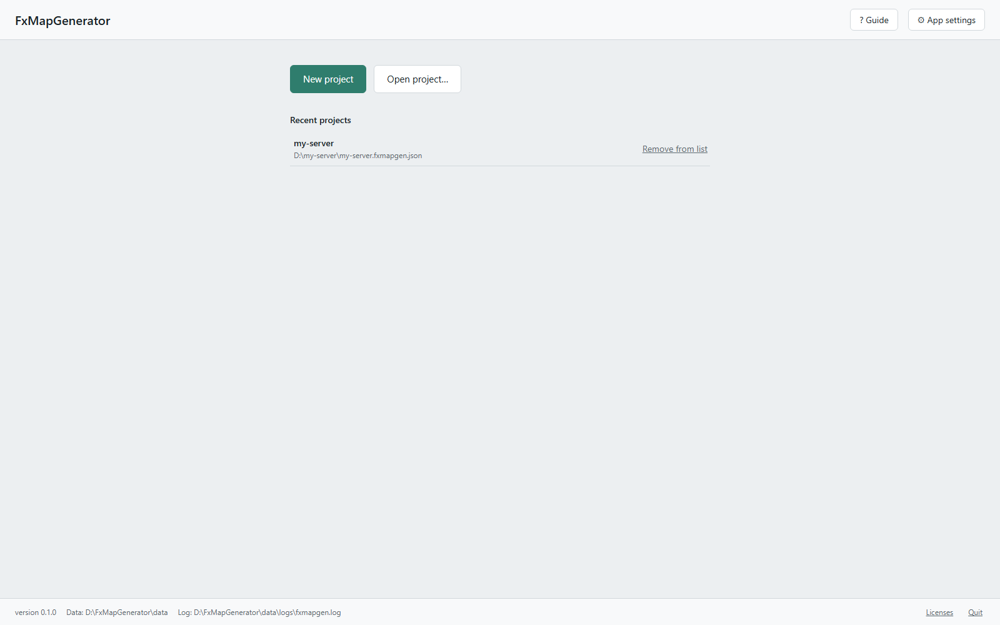
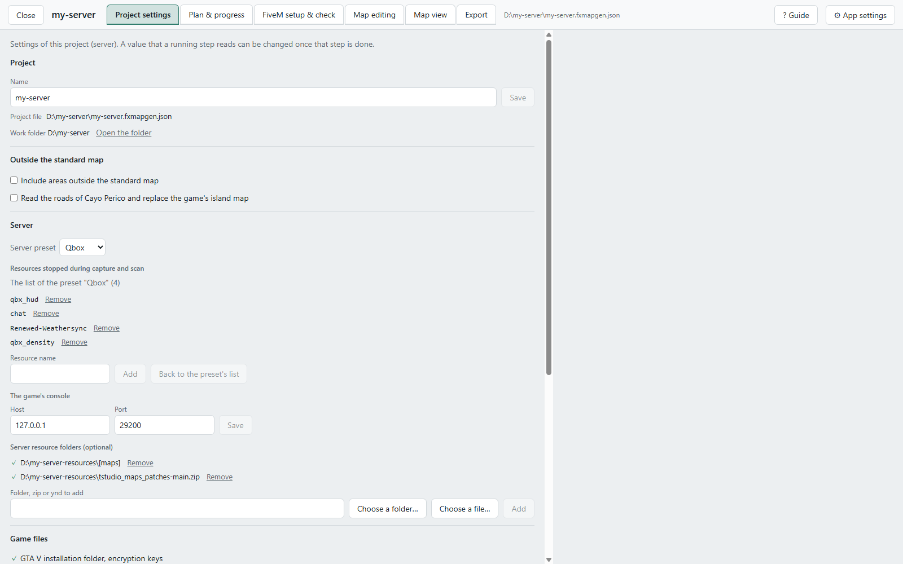
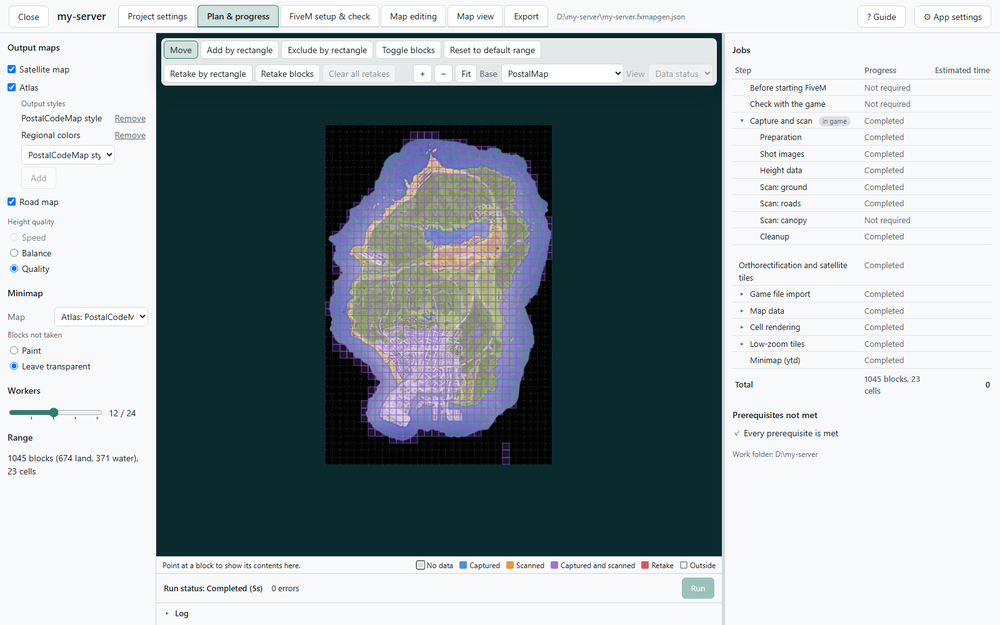
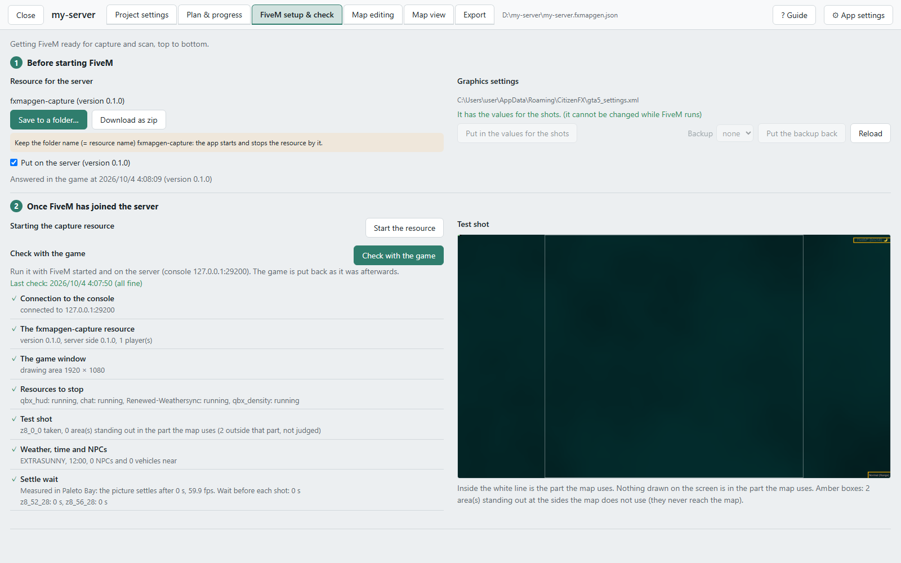
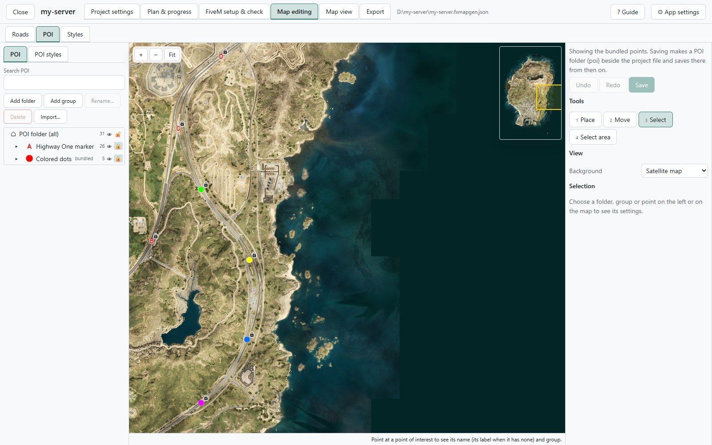
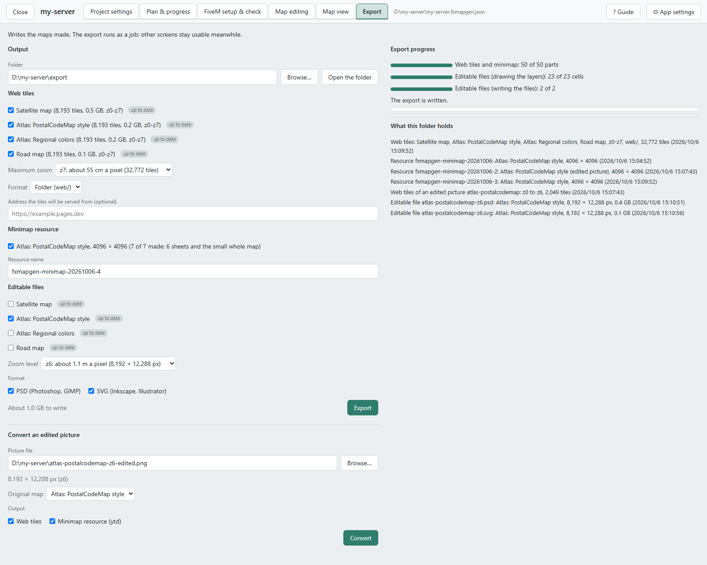

# The screens

English | [日本語](screens.ja.md)

What each screen is for, and its main parts. The steps for making a map are in [Your first map](walkthrough.md);
how-tos by what you want to do, and what to do when something fails, are in [Questions and answers](faq.md).

The screens explain themselves as well.

- **The guide**: **? Guide** in the header lights up the main parts of the screen one after another and explains them in
  a box. The first time you open a screen, it asks whether to show its guide.
- **Hover help**: hover over an item to read what it does. A button that cannot be pressed says why.

| Screen | What you do there |
|---|---|
| [The start screen](#the-start-screen) | Make and open projects; the app settings |
| [Project settings](#project-settings) | The project's settings: the server, land outside the standard map, labels and more |
| [Plan & progress](#plan--progress) | Decide the maps and the range, and run |
| [FiveM setup & check](#fivem-setup--check) | Put the capture resource on the server, the graphics settings, the check with the game |
| [Map editing](#map-editing) | Change roads, POI and styles |
| [Map view](#map-view) | Look at the maps you made |
| [Export](#export) | Write the web tiles, the minimap resource and the editable files; convert an edited picture |

## The start screen

The first screen after starting the exe.

  

  

- **New project**: makes a project from a project name, where to save the project file (`.fxmapgen.json`), a work
  folder, a server preset and the maps to make. All of it can be changed later. The work folder holds the large data:
  the captures, the scans and the tiles (around 10 GB for the whole map).
- **Open project…**: opens a saved project file.
- **Recent projects**: the projects you have opened, newest first, up to ten. **Remove from list** only takes one off
  the list; the file is not deleted.
- **The running job**: while a job runs, its project is shown here. **Open this project** goes back to it.
- **⚙ App settings**: the screens' language and theme (light, dark), and where GTA V and the encryption keys are. They
  are shared by every project on this PC. Empty fields for GTA V and the keys are detected automatically.
- **At the bottom**: where the settings and the log are (`%LOCALAPPDATA%\FxMapGenerator`), **Licenses** and **Quit**.
  Closing the browser tab leaves the app and a running job going. **Quit** ends the app (a running job is stopped at
  once first).

With a project open, tabs appear in the header. A tab whose screen has prerequisites not met shows ✗ and how many.
**Close** goes back to the start screen (a running job goes on).

## Project settings

The settings of this project (this server). Each item shows the result of its check (✓ / ✗).

  

- **Project**: the name, the project file and the work folder. **Open the folder** opens the work folder.
- **Outside the standard map**: adds cells at the top, bottom, left and right to map land outside GTA V's standard map,
  such as Cayo Perico ([Questions and answers](faq.md#cayo-perico-roxwood-and-other-land-outside-the-standard-map)).
- **Server**: the server preset (Qbox, QBCore); **Resources stopped during capture and scan** (what shows in the
  photographs or affects the rendering, such as the HUD, notifications and chat; they are started again afterwards);
  and **The game's console** (normally left at `127.0.0.1:29200`). The game's console is the FiveM client's console (the
  one F8 opens in the game), not the server's console. The app drives the game through it.
- **Server resource folders**: when the server ships road data of its own (`.ynd`), the folders, zips or ynd files of
  those resources (optional). Add them in the order the server starts them; where two cover the same area, the later
  one wins.
- **Game files**: where GTA V and the encryption keys are, which the atlas and the road map and the export of the
  minimap resource read. The places are set in **App settings**.
- **Labels (atlas)**: the atlas map's text. **Map languages** (English is always made, Japanese is a choice), the
  source of the postal codes (by default the list of nearest-postal) and the fonts used.
- **Disk**: the free space on the work folder's drive, and how much is needed.

A value that a running step uses cannot be changed until that step is over.

## Plan & progress

Where you decide the maps and the range, run, and watch the progress.

  

**The left panel**

- **Output maps**: satellite map, atlas, road map. For the atlas, each line under **Output styles** is one map.
  **Height quality** (Speed, Balance, Quality) is time against finish. The job list on the right follows your choices
  at once.
- **Minimap**: the map used for the in-game map (**Map**) and how the blocks outside the range are shown (**Blocks not
  taken**: painted, or left transparent). The minimap resource itself is written on **Export**.
- **Workers**: how many units are worked on at the same time in the steps without the game. It can be changed during a
  run too.
- **Range**: the number of blocks the maps are made of. At first it is the default range (1,045 blocks).

**The map in the middle**

The grid of blocks (281.25 m square), colored by what has been taken of each. The legend is below the map. The tools at
its top left change the range.

- **Add by rectangle**, **Exclude by rectangle**, **Toggle blocks**: add blocks to the range or take them out.
- **Retake by rectangle**, **Retake blocks**, **Clear all retakes**: mark blocks to capture again, or take the marks off.
- **Add a preset**: adds the blocks of Cayo Perico or Roxwood at once (shown once **Include areas outside the standard
  map** is on in **Project settings**).
- **Reset to default range**: undoes what you added and excluded.

**The right panel**

- **Jobs**: the steps that follow from the maps and the range, with the work left and the estimated time. ▸ opens the
  details, and clicking a step's name outlines its blocks on the map. "in game" marks the steps that use FiveM, "manual"
  what you do yourself on **FiveM setup & check**.
- **Prerequisites not met**: what has to be fixed before a run. The link in a row goes to the screen that fixes it.
- **Run status**: **Run** runs the work left in the job list as one job. During a run it shows the progress, the units
  being worked on, errors and the log, with **Stop after current units** and **Stop now**. The first stops once the
  units being worked on are finished, the second interrupts them. Either way the next **Run** goes on from there.

The steps come in this order: Capture and scan (in the game), Orthorectification and satellite tiles, Game file import,
Map data (Road graph, Land cover, Region colors, Labels, Roads), Cell rendering, Low-zoom tiles, Minimap. Steps that
the chosen maps do not need are not shown.

During a run, settings that the running step does not use can still be changed. The change counts from the next run.

## FiveM setup & check

The preparation on FiveM's side before the capture and scan. Go from top to bottom.

  

**Before starting FiveM**

- **Resource for the server**: put the capture resource `fxmapgen-capture` (it comes inside the app) into the server's
  `resources`. **Save to a folder…** writes it into a folder, **Download as zip** hands it out as a zip. Do not rename
  the folder (the app starts and stops the resource by this name). There is no need to write it into `server.cfg` (the
  app starts it through the game's console). **Put on the server** is ticked by itself when the app saved the resource
  and when the resource answered in the game; tick it yourself when you put it there another way. A new version of the
  app takes the tick off (the resource has to be the same version).
- **Graphics settings**: the items of FiveM's graphics settings (`gta5_settings.xml`) that differ from what the shots
  need. With FiveM closed, press **Put in the values for the shots**. The file as it was is kept, and **Put the backup
  back** restores it.

**Once FiveM has joined the server**

- **Starting the capture resource**: **Start the resource** checks that the resource answers and, if it does not, sends
  `refresh` and `ensure fxmapgen-capture` through the game's console. This needs the permission to send server commands.
- **Check with the game**: **Check with the game** checks seven items (about 15 seconds; do not touch the game
  meanwhile).

  | Item | What is checked |
  |---|---|
  | Connection to the console | Whether the game's console can be reached. Only one program can use the game's console at a time |
  | The fxmapgen-capture resource | Whether the resource is the app's version, you may capture, and nobody else is on the server |
  | The game window | Whether it is windowed at 1920×1080 |
  | Resources to stop | The state of the resources stopped during the capture |
  | Test shot | A shot of the open sea: whether anything on the screen (HUD, text, notifications) is in the part the map uses |
  | Weather, time and NPCs | Whether the capture environment gives clear weather, noon and no NPCs |
  | Settle wait | How long this PC takes, after loading, until the picture stops changing (used as the wait before a shot) |

  An item with ✗ says how to fix it. The game is put back as it was afterwards. The result also shows among the
  prerequisites on **Plan & progress**.
- **Test shot**: the photograph the check took. The part inside the white lines is what the map uses. Red frames are
  things on the screen that got into that part; amber frames are things outside it (they never reach the map).

Once every block of the range has been captured and scanned, the app stops the capture resource, and a check made
before that counts as not made.

## Map editing

Where you change what the maps draw. The switch at the top picks **Roads**, **POI** or **Styles**. Saved edits reach
the maps at the next run (the job list on **Plan & progress** shows what is made again and how long it takes). Applying
edits does not need the game.

### Roads

Changes to the game's road data, kept in `road-edits.json` beside the project file. Nodes and links can be added, moved
and hidden; lanes, width, street names and more can be changed. The game's data is not changed (the game's traffic and
GPS do not see the edits). The editor works in a project that makes an atlas or a road map.

  

- **The left map**: the game's road data (nodes and links) and your edits. Colors tell what is added, changed and
  hidden. You select and edit here.
- **The right map**: the roads as the map draws them, worked out with the edits not yet saved. It moves with the left
  map. Before the capture and scan are over the shapes are provisional: roads on water and unpaved roads are told apart
  once they are.
- **Tools**: pick a tool (keys 1 to 5): Draw, Move, Select, Select area (with Ctrl, what a traced outline holds), Whole
  road. Removing or hiding what is selected, and showing it again, are here too.
- **Import bundled edits…**: takes in, group by group, the edits that come with the app: the airfields' runways, hiking
  trails, Cayo Perico's roads, additional minor roads, fixes of road shapes in the city, and North Yankton's roads
  hidden. A new project starts with them.
- **Shown on the left map**: the kinds shown on the left map. A kind not shown is not drawn and cannot be selected.
- **Selection**: the values of the selected nodes and links (street name, flags, height, lanes, width).
- **Edits**: one row per edit. Clicking a row goes to its place, **Revert** undoes it. An edit that no longer fits the
  server's road data is listed under **Edits not applied** with the reason.
- **Save**: saving puts the work to make again into the job list on **Plan & progress**. Edits saved during a run
  before its road steps start (during the capture and scan, for example) go into the maps of that run.
- **Read the game files**: the road editor needs the game's road data read. This button reads it, also before the
  capture and scan are over, and reads it again after GTA V or the server's road data (`.ynd`) changed.

### POI

Markers drawn on the maps.

  

- **POI and POI styles**: the switch at the top of the left panel, between the points and their looks.
- **The tree**: folders, then groups, then points. The eye button shows and hides, the lock button locks, dragging
  reorders and moves. What comes with the app (the Highway One markers A to Z and the colored dots) is marked "bundled".
- **Folders and groups**: add, rename, delete. **Import…** reads points from a CSV or JSON file into a new group.
- **The map**: draws the POI as the maps do. The tools (keys 1 to 4) are Place (into the group selected on the left),
  Move, Select and Select area.
- **The selected item**: the values of the selected folder, group or point. The POI style and the maps to show on
  (atlas, road map) come from the folder above when not set; a value taken from above is shown faintly with where it
  comes from.
- **Label and name**: the map draws the **Label**, written per map language (an English map is drawn with an English
  font, so Japanese characters may show as boxes). The **Name** is for the list and the search.
- **POI styles**: the look: how it is drawn (text, text in a circle, a circle, an icon), color, size and more. Icons
  are Material Design Icons or your own PNG files. A bundled style is duplicated before it can be edited.
- **Save**: the first save copies the POI, the bundled ones included, into `poi/` and `poi-styles.json` beside the
  project file (PNG files into `poi-icons/`).

The minimap is the chosen map's pictures as they are, so POI drawn on that map also show on the in-game map.

### Styles

The look of the atlas map (the colors and sizes of ground, water, buildings, roads and text, the fonts, and more). The
road map's look cannot be changed.

  

- **Style**: the style to edit. The bundled styles cannot be changed: **Duplicate…** makes your own style to edit (kept
  as its differences from the bundled style in `styles/<id>.json` beside the project file). **Export…** and **Import…**
  move a style as a file, and **Save as shared style** offers it to **Duplicate…** in your other projects too.
- **The items**: grouped, with a search field at the top. An item changed from its base is marked and gets **Revert**.
  Clicking a color's swatch opens the color picker (RGB, an eyedropper, the colors in use); numbers are set with a
  slider and a field.
- **Preview**: the same place twice, with the saved values (or the base style) on the left and the values being edited
  on the right. Changing a value draws the right side again. Clicking a point of the preview tells which item its color
  comes from.
- **Sample land and This project**: **Sample land** is a made-up stretch of land that comes with the app and needs no
  data. **This project** is a real place of your maps, once they are made. The window drawn is 500 m to 4 km across,
  and the small map at the bottom right moves it.
- **Used by**: the maps made with this style.
- **Save**: saving puts the maps that use the style into the job list on **Plan & progress** to be made again.

Your own styles are chosen under **Output styles** on **Plan & progress**.

Water has an opacity (per depth band, and for water without bands; 0 % is clear). The bundled styles "PostalCodeMap
style" and "Regional colors" get lighter with depth and leave the sea deeper than 200 m clear.

## Map view

Shows the maps you made: the tiles of the work folder as they are (the same the export writes).

  

- **Maps shown**: the **Base** map, the **Overlay** and the overlay's opacity. Besides the maps you made, PostalMap can
  be chosen.
- **Compare with before**: compares the tiles written over since the last export with what they were (the X key
  switches). It jumps to the changed places and lists those with no visible difference last. Before the first export,
  it compares with the maps before the first run that wrote over them.
- **Grids**: draws the borders of blocks, cells (8 × 8 blocks) and minimap sheets (4500 m) over the map.
- **Go to**: jumps to the main places. **Fit** shows the whole map again.
- **Clicked point**: click the map to see that point's coordinates, block and scanned values (material, height, zone,
  street name and more).

## Export

Writes the maps you made. The export runs as a job, and you can move to other screens meanwhile.

  

- **Output**: the folder to export into: an empty folder, or one you exported into before. **Open the folder** opens it
  in Explorer.
- **Web tiles**: the maps to export. Each map says "up to date" or "jobs left" (its tiles do not show the latest data
  yet).
  - **Maximum zoom**: z8, z7 or z6. Each level less leaves about a quarter of the files. The viewer and lb-phone
    stretch the tiles beyond the maximum zoom.
  - **Format**: a folder (`web/`) or a zip (`web.zip`), with the same contents.
  - **Address the tiles will be served from** (optional): used in the lb-phone example.
- **Minimap resource**: makes, from the map chosen under **Minimap** on **Plan & progress**, a resource that replaces
  the game's radar and pause map. The resource name is at first a name with the date. Hand out maps you made again
  under a new name (FiveM keeps the files of a resource of the same name on the players' PCs).
- **Editable files**: writes a map as a file split into layers, for working on it in a paint program such as
  Photoshop, GIMP or Inkscape. The whole map frame becomes one file in the folder `editable` of the export folder. The
  maps to write are chosen anew for every export (the choice of maps is not kept).
  - **Zoom level**: z6 or z7. z6 has the pixels of the in-game map. z7 has four times the pixels, and the paint
    program needs four times the memory (about 1.6 GB a layer for a map of the standard size).
  - **Format**: PSD (Photoshop, GIMP) and SVG (Inkscape, Illustrator). With both chosen, every map chosen is written
    in both formats.
- **Export**: writes what you chose. When that cannot be exported, the reason is shown above. The web part is made
  anew by every export.
- **Convert an edited picture**: makes web tiles and a minimap resource from an editable file that was edited in a
  paint program and written out as one PNG picture of the whole map. It is a separate operation from **Export** above:
  **Convert** in this group runs it. Nothing is added to the project's maps (the picture does not show on **Map view**).
  - **Picture file**: the PNG picture to convert: a picture of the whole map frame, of the size of an editable file
    (z6 or z7). Write it without interlacing. When the size does not fit, the sizes the map takes are shown.
  - **Original map**: the map the picture was made from. Its tile folder name, its title, the color of its sea and its
    credits are used. A picture whose file name starts with an editable file's name gets that map chosen.
  - **Output** (inside this group): **Web tiles** and **Minimap resource (ytd)**. The web tiles go into
    `web-edited/<map>/` of the export folder (the contents of `web/`, with tiles up to the picture's zoom level). The
    minimap resource gets a new name with the date.
- **Export progress**: the progress, and a button to stop.
- **What this folder holds**: what was exported into this folder before, the editable files and what was made from
  edited pictures included.

**Inside the minimap resource**

- The pictures of the standard map (six sheets each for the pause map and the radar) and the small whole map laid under
  the radar.
- The pictures outside the standard map (when added cells hold blocks of the range).
- Files that hide the game's own minimap lines, and the zoom settings.
- The list of the maps of building interiors and underground passages. Inside shops and houses the radar and the pause
  map switch to the building's floor plan, and in the metro, the storm drains and the road tunnels the passages are
  laid over the map. The list is read from this PC's GTA V files when the resource is written, so GTA V and the keys
  are needed.
- [Extra Map Tiles](https://github.com/alexlicuriceanu/extra-map-tiles) 3.0.1 (MIT License, bundled), which draws the
  map outside the standard map.
- In a project that reads Cayo Perico's roads, an island map that draws nothing (the island then shows as the map's own
  pictures). It too is made from this PC's GTA V files when the resource is written.

How to install it is in the resource's own `README.txt` and in [Your first map](walkthrough.md#10-put-them-in-place).

**Inside the editable files**

- The layers are, bottom first: Ground, Shading (dark side), Shading (light side), Tree canopy, Water, Buildings,
  Contours, Railway, Roads, Postal codes, Points of interest, Zone names, Street names. What a map does not have is
  left out. A satellite map is one layer, the photograph. The layers are named in the language of the screens.
- The shading is the two layers right above the ground, with their blend modes set: Multiply for the dark side, Color
  Dodge for the light side. They can be hidden, or made weaker by lowering their opacity.
- A PSD file (`<map>-z<zoom level>.psd`): every layer is a picture. A picture over 30,000 pixels a side or over 2 GB
  is written in the large document format (`.psb`).
- An SVG file (`<map>-z<zoom level>.svg`): the roads stay shapes, and the postal codes, points of interest, zone names
  and street names stay text. The layers for the ground, the shading, water, buildings and the like are PNG pictures
  in a folder named as the SVG file with `-svg` added. Move that folder together with the SVG file. Text is shown with
  the fonts installed on the PC that opens the file.
- Opened and checked with GIMP 3.2 and Inkscape 1.4, not with Photoshop or Illustrator.

The steps from editing a file to the in-game map and the web map are in Questions and answers:
[Editing a map in Photoshop or GIMP (PSD)](faq.md#editing-a-map-in-photoshop-or-gimp-psd) and
[Editing a map in Inkscape or Illustrator (SVG)](faq.md#editing-a-map-in-inkscape-or-illustrator-svg).
