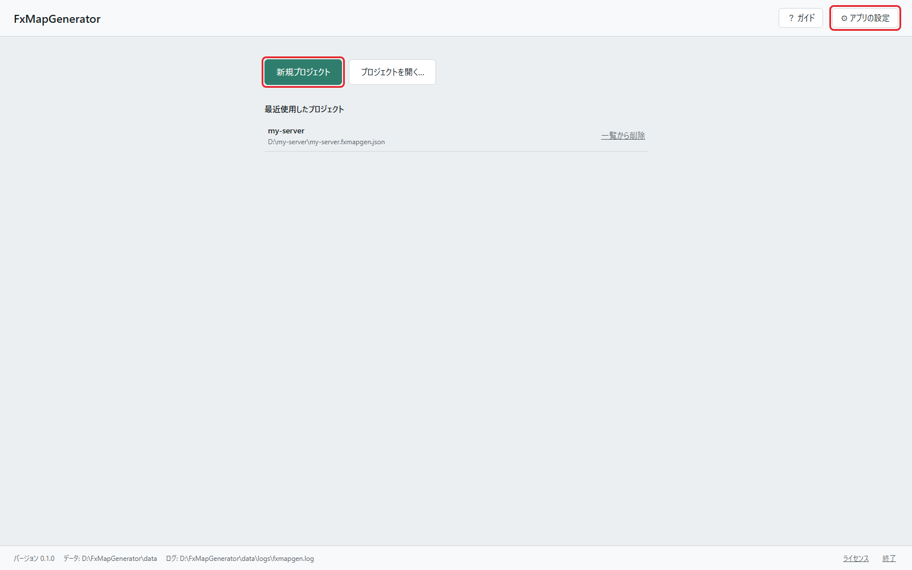
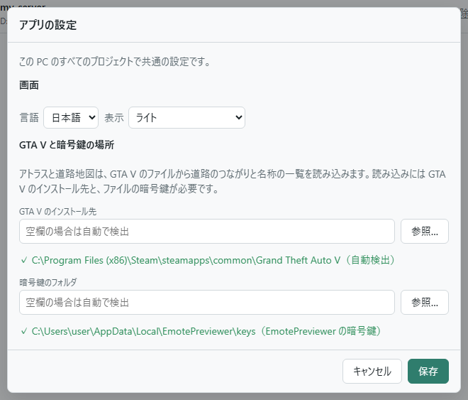
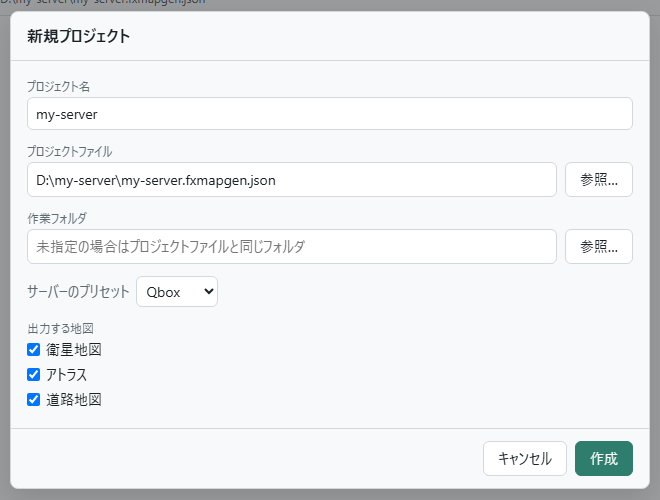
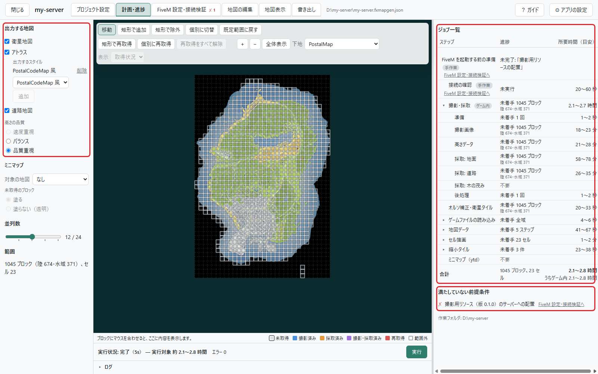
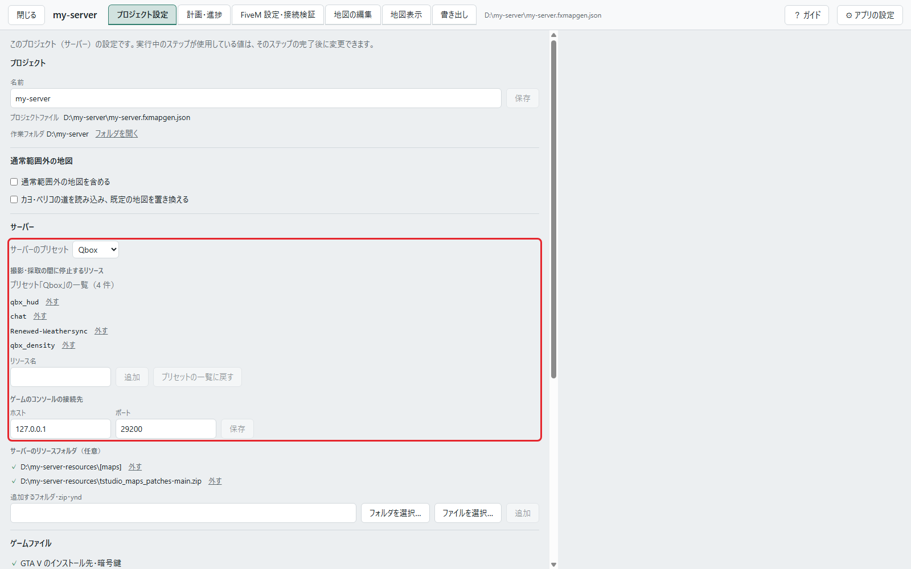
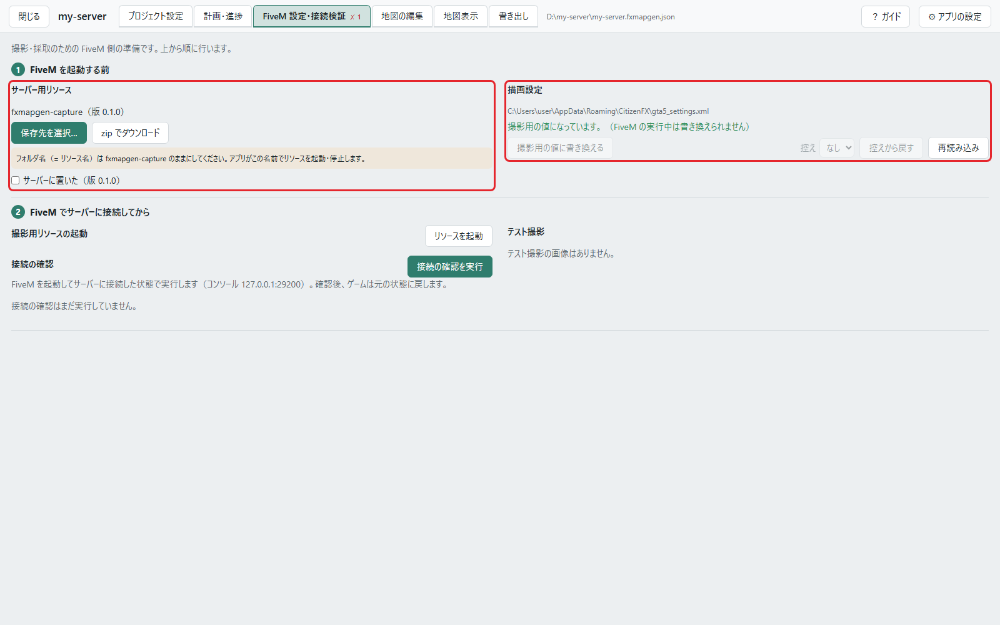
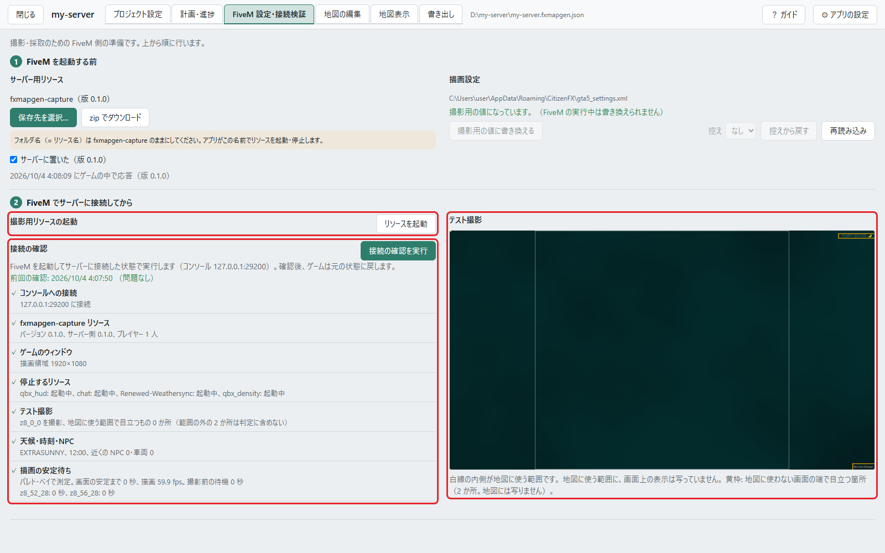
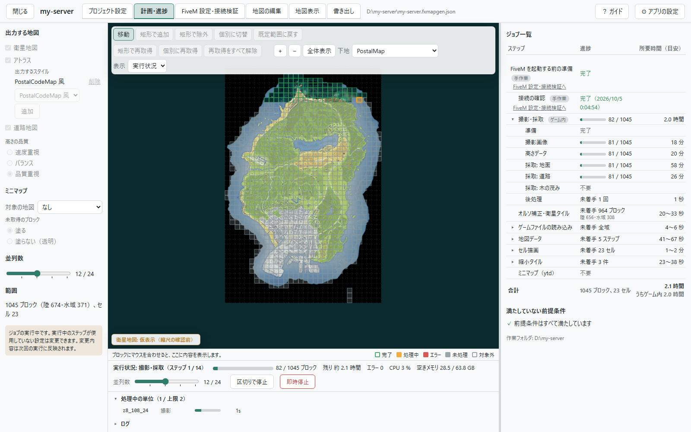
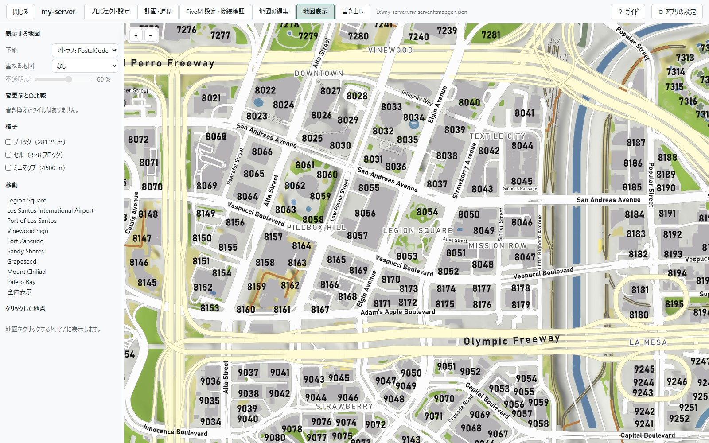
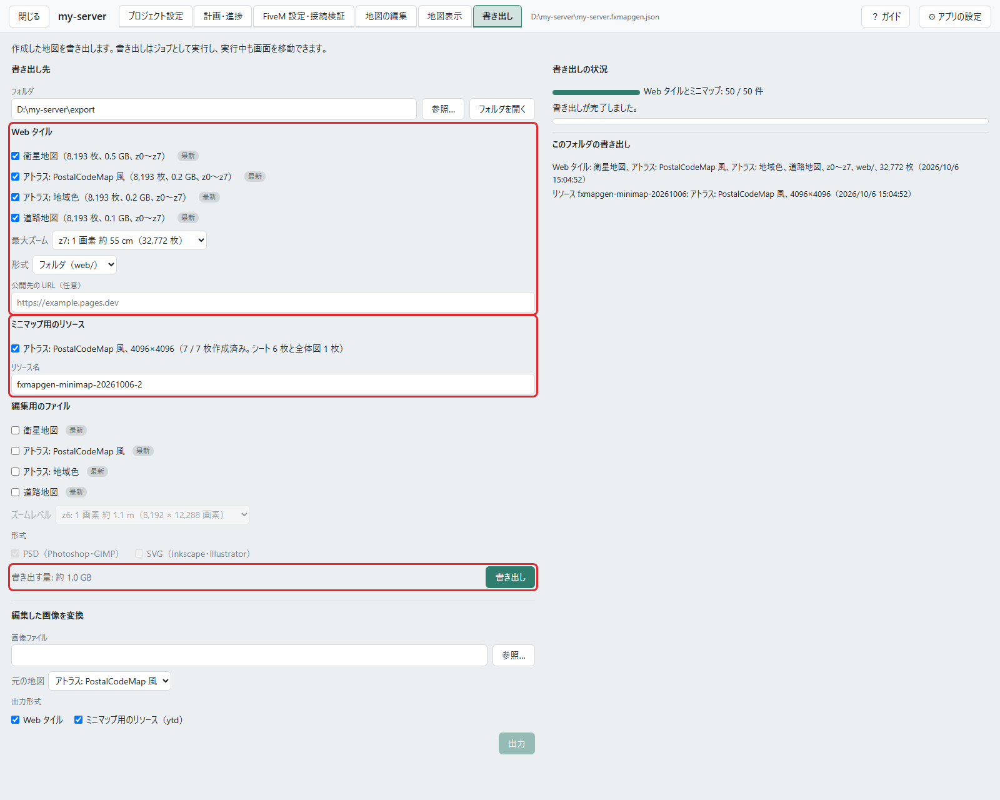

# はじめての地図

[English](walkthrough.md) | 日本語

FxMapGenerator をダウンロードしてから、地図を作り、ゲームと Web に配置するまでを、順に説明します。

ここで作るのは、GTA V の通常の地図の範囲（既定の範囲）の、衛星地図・アトラス地図・道路地図です。カヨ・ペリコなどの
通常の地図の外、日本語の地図、地図の更新は、[よくある質問](faq.ja.md) にあります。画面の細かい所は
[画面ごとの説明](screens.ja.md) を見てください。

## 全体の流れ

| # | すること | 場所 |
|---|---|---|
| 1 | 用意する（暗号鍵、サーバー、時間） | — |
| 2 | ダウンロードして起動する | スタート画面 |
| 3 | プロジェクトを作る | 「新規プロジェクト」 |
| 4 | 作る地図を選ぶ | 「計画・進捗」 |
| 5 | サーバーの設定を確認する | 「プロジェクト設定」 |
| 6 | FiveM 側を準備する | 「FiveM 設定・接続検証」 |
| 7 | 実行する（撮影・採取 → 地図の作成） | 「計画・進捗」 |
| 8 | 地図を確認する | 「地図表示」 |
| 9 | 書き出す | 「書き出し」 |
| 10 | 配置する（ゲーム内の地図、Web 地図） | サーバー、Web のホスト |
| 11 | 後片付け | 「FiveM 設定・接続検証」 |

ゲームを使うのは 6 と 7 の前半（撮影・採取）だけです。そのほかは、ゲームを閉じていてもできます。

## 1. 用意する

**PC**

- GTA V と FiveM の入った Windows の PC。撮影と採取は、この PC のゲームで行います。
- 作業フォルダを置くドライブに、全域で 10 GB 前後の空き。

**サーバー**

- 撮影用のリソース（アプリに同梱）を、サーバーの `resources` に置けること。
- 撮影するプレイヤー（あなた）に、権限 `command.fxmapgen` があること。`command` を許された管理者は、すでに持っています。
  リソースの起動にも、サーバーのコマンドを送る権限を使います。
- **撮影の間、サーバーの車と NPC をすべて消します。** ほかのプレイヤーがいるときは、消さずに撮影を断ります。ほかに誰も
  いない時間か、複製したサーバーで行ってください。

**暗号鍵**（アトラス地図か道路地図を作るときと、ミニマップ用のリソースを書き出すとき）

[EmotePreviewer Key Tool の Releases](https://github.com/Acc-Off/EmotePreviewerKeyTool/releases) から
`EmotePreviewerKeyTool-<version>-win-x64.exe` をダウンロードして実行します。`GTA5.exe` から鍵を読み、
`%LOCALAPPDATA%\EmotePreviewer\keys` に書き出します。FxMapGenerator は、このフォルダを自動で見つけます。一度だけで済みます。

**時間**

ゲームを使う時間（撮影・採取）の目安です。全域（既定の範囲の 1,045 ブロック）の場合で、PC とサーバーによって変わります。
その間、ゲームは使えません。「高さの品質」は、手順 4 で選びます。

| 作る地図 | 速度重視 | バランス | 品質重視 |
|---|---|---|---|
| 衛星地図だけ | 約 40 分 | 約 80 分 | 約 110 分 |
| 衛星地図とアトラス・道路地図 | － | 約 110 分 | 約 140 分 |
| アトラス・道路地図だけ | － | 約 120 分 | 約 130 分 |

撮影・採取の後に、ゲームを使わない作業（地図の作成）が続きます。こちらの時間は、選んだ並列数での見積もりが画面に出ます。

## 2. ダウンロードして起動する

1. [Releases](https://github.com/Acc-Off/FxMapGenerator/releases) から `FxMapGenerator-<version>-win-x64.exe` を
   ダウンロードします。置く場所はどこでもかまいません。
   - `…-slim.exe` は小さい代わりに、.NET 10 の Desktop Runtime と ASP.NET Core Runtime（x64）が必要です。
2. 実行します。コード署名をしていないため、Windows SmartScreen が確認を出すことがあります（「詳細情報」→「実行」）。
3. アプリのコンソールウィンドウ（黒いウィンドウ）が開き、ブラウザでスタート画面（`http://127.0.0.1:20400/`）が開きます。
4. 「⚙ アプリの設定」を開き、「GTA V と暗号鍵の場所」の 2 つが ✓ になっていることを確認します。空欄なら自動で検出します。
   ✗ のときは、表示された理由に従ってフォルダを指定します。

<p align="center">
  
  <br>
  <em>赤枠: 「新規プロジェクト」と「⚙ アプリの設定」</em>
</p>

<p align="center">
  
  <br>
  <em>「⚙ アプリの設定」の窓。GTA V と暗号鍵の場所が ✓ なら準備できています</em>
</p>

画面を初めて開いたときに、右下でその画面のガイドを表示するかを聞きます（「表示する」「あとで」「今後表示しない」）。
ガイドは、上の帯の「？ ガイド」からいつでも表示できます。画面の項目にマウスを乗せると、その解説が出ます。

ブラウザのタブを閉じても、アプリは動き続けます。アプリを終了するときは、画面の下の「終了」を押します。

## 3. プロジェクトを作る

プロジェクトは、1 つのサーバーの地図を作るための設定とデータのまとまりです。

1. 「新規プロジェクト」を押します。
2. 次の項目を入力します。どれも後から変更できます。
   - **プロジェクト名**: 画面に表示する名前です。
   - **プロジェクトファイル**: 設定を保存するファイル（`.fxmapgen.json`）です。例: `D:\my-server\my-server.fxmapgen.json`
   - **作業フォルダ**: 撮影画像やタイルを置くフォルダです。指定しなければ、プロジェクトファイルと同じフォルダです。
   - **サーバーのプリセット**: Qbox か QBCore。撮影・採取の間に停止するリソースなどが決まります。
   - **出力する地図**: 衛星地図、アトラス、道路地図。
3. 「作成」を押すと、「計画・進捗」の画面が開きます。

<p align="center">
  
</p>

## 4. 作る地図を選ぶ（計画・進捗）

「計画・進捗」は、作る地図と範囲を決め、実行して、進み具合を見る画面です。左に設定、中央に地図、右に「ジョブ一覧」が
あります。

<p align="center">
  
  <br>
  <em>赤枠: 左が「出力する地図」、右の上が「ジョブ一覧」、右の下が「満たしていない前提条件」</em>
</p>

左の欄を上から確認します。

- **出力する地図**: 作る地図です。アトラスは、「出力するスタイル」の 1 行が 1 つの地図になります（同梱は
  「PostalCodeMap 風」と「地域色」）。
- **高さの品質**: 時間と仕上がりの兼ね合いです（手順 1 の表）。項目にマウスを乗せると、違いの説明が出ます。
- **ミニマップ**: ゲーム内の地図にする地図を「対象の地図」で選びます。
- **並列数**: ゲームを使わない作業で、同時に処理する数です。実行中にも変更できます。
- **範囲**: はじめは既定の範囲（1,045 ブロック。陸と、陸に近い水域）です。ここでは変えません。

選ぶと、右の「ジョブ一覧」に、残りの作業と所要時間の見積もりが出ます。「ゲーム内」の印が付いた行は、FiveM を使う作業です。

右の欄の「満たしていない前提条件」には、実行の前に済ませることが並びます。この時点では、FiveM に関する項目が
残っています。次の 2 つの手順で済ませます。

## 5. サーバーの設定を確認する（プロジェクト設定）

「プロジェクト設定」タブを開き、「サーバー」の欄を確認します。

- **撮影・採取の間に停止するリソース**: HUD・通知・チャットなど、写真に写るものや描画に影響するリソースです。
  はじめはプリセットの一覧です。撮影・採取が終わると、アプリが起動し直します。あなたのサーバーで画面に何かを出す
  リソースがほかにあれば、ここに追加します（手順 6 のテスト撮影で、写り込みを確認できます）。
- **ゲームのコンソールの接続先**: 通常は `127.0.0.1:29200` のままです。ゲームのコンソールは、FiveM クライアントの
  コンソール（ゲームの中で F8 で開くもの）です。サーバーのコンソールではありません。アプリは、これを通してゲームを
  操作します。

サーバーが独自の道路データ（`.ynd`）を配布しているときは、「サーバーのリソースフォルダ」に、そのリソースのフォルダ・
zip・ynd を追加します。配布していなければ、空のままでかまいません。

<p align="center">
  
  <br>
  <em>赤枠: 「サーバー」の欄</em>
</p>

## 6. FiveM 側を準備する（FiveM 設定・接続検証）

「FiveM 設定・接続検証」タブを開き、上から順に行います。

<p align="center">
  
  <br>
  <em>赤枠: 左が「サーバー用リソース」、右が「描画設定」</em>
</p>

### FiveM を起動する前

1. **サーバー用リソース**: 撮影用のリソース `fxmapgen-capture` を、サーバーの `resources` に置きます。
   - サーバーがこの PC にあるか共有フォルダなら、「保存先を選択…」でサーバーの `resources` を選びます。
   - 別の場所にあるサーバーなら、「zip でダウンロード」で受け取り、サーバーの `resources` に展開してから、
     「サーバーに置いた」にチェックします。
   - フォルダ名は `fxmapgen-capture` のままにしてください。`server.cfg` に書く必要はありません（アプリが
     ゲームのコンソール経由で起動します）。
2. **描画設定**: FiveM を終了した状態で、「撮影用の値に書き換える」を押します。ゲームのウィンドウ（1920×1080 の
   ウィンドウモード）と画質を、撮影用の値にそろえます。書き換える前のファイルは保存してあり、後で戻せます（手順 11）。

### FiveM でサーバーに接続してから

3. FiveM を起動して、サーバーに接続します。ゲームのコンソールを使うほかのツール（FxDeck など）は閉じてください。
   ゲームのコンソールは、同時に 1 つのプログラムしか使えません。
4. **撮影用リソースの起動**: 「リソースを起動」を押します。アプリがゲームのコンソールから `refresh` と
   `ensure fxmapgen-capture` を送ります（最大 20 秒ほど）。
5. **接続の確認**: 「接続の確認を実行」を押します。15 秒ほどかかります。その間、ゲームの画面は操作しないでください。
   7 つの項目（ゲームのコンソールへの接続、リソース、ゲームのウィンドウ、停止するリソース、テスト撮影、天候・時刻・NPC、
   描画の安定待ち）を確認し、✗ の項目には直し方が出ます。
6. **テスト撮影**: 接続の確認で撮った写真が出ます。白線の内側が、地図に使う範囲です。赤枠は、写り込んだ画面上の表示
   です。赤枠があるときは、その表示を出しているリソースを、「プロジェクト設定」の「撮影・採取の間に停止するリソース」に
   追加して、もう一度確認します。

<p align="center">
  
  <br>
  <em>赤枠: 左の上が「リソースを起動」、左の下が接続の確認の結果、右が「テスト撮影」</em>
</p>

すべて ✓ になると、「計画・進捗」の「満たしていない前提条件」が「前提条件はすべて満たしています」に変わります。

## 7. 実行する（計画・進捗）

「計画・進捗」に戻り、「実行」を押します。ジョブ一覧の残りの作業を、1 つのジョブとして順に実行します。

**撮影・採取の間（ゲームを使う間）**

- ゲームの画面に触らないでください。アプリがカメラをブロックの上に順に動かし、撮影と、地面・道の採取を行います。
- あなたのキャラクターは見えなくなり、固定されます。終わると元の場所に戻ります。
- 中央の地図に、済んだブロックと処理中のブロックが色で出ます。撮影の済んだブロックから、衛星地図が地図に出てきます。

<p align="center">
  
  <br>
  <em>撮影・採取の間。済んだブロックから、衛星地図が出てきます</em>
</p>

**止めるとき、続けるとき**

- 「区切りで停止」は、処理中のブロックが終わってから停止します。「即時停止」は、すぐに停止します。
- どちらで止めても、次の「実行」は続きから始まります。日を分けて進められます。
- ブラウザを閉じても、実行は続きます。もう一度 exe を起動するか、`http://127.0.0.1:20400/` を開くと、画面に戻れます。

**撮影・採取が終わったら**

- 「ゲームを使う作業は完了しました。FiveM とサーバーは終了できます。」と出ます。アプリは撮影用リソースを停止し、
  停止していたリソースを起動し直します。
- 残りの作業（オルソ補正、地図データ、セル描画、縮小タイル、ミニマップ）は、ゲームなしで続きます。並列数の分だけ
  同時に進み、地図にその様子が出ます。

<p align="center">
  
  <br>
  <em>地図の作成の間。並列数の分だけ、セルを同時に描きます</em>
</p>

ジョブ一覧の残りがなくなれば、地図の完成です。

## 8. 地図を確認する（地図表示）

「地図表示」タブで、作成した地図を見ます。書き出すものと同じタイルです。

- 「表示する地図」で、下地と重ねる地図、重ねる地図の不透明度を選びます。衛星地図の上にアトラス地図を半透明で重ねると、
  ずれや抜けを見つけやすくなります。
- 「移動」で、主な場所へ移動できます。
- 地図を押すと、その地点の値（ブロック、材質、高さ、地区、通り名など）が左に出ます。

<p align="center">
  
</p>

見ておくとよい所:

- **衛星地図に通知が写っていないか。** 撮影の瞬間に出ていた通知は、写真に写ることがあります。写ったブロックは、
  「計画・進捗」の地図で再取得の印を付けて実行すると、そのブロックだけを撮り直します
  （[よくある質問](faq.ja.md#写真に通知が写っている)）。
- **MLO の道や橋が描かれているか。** 道のデータを持たない MLO の道は、道ではなく地面や建物として描かれます。
  「地図の編集」→「道路」で描き足せます（[画面ごとの説明](screens.ja.md#道路)）。

## 9. 書き出す（書き出し）

「書き出し」タブを開きます。

1. **書き出し先**: 書き出すフォルダです。はじめは、プロジェクトファイルの横の `export` です。
2. **Web タイル**: 書き出す地図にチェックし、最大ズームを選びます。
   - 最大ズームを 1 段下げるごとに、ファイル数は約 4 分の 1 になります（衛星地図の全域で、z8 は 32,769、z7 は 8,193、
     z6 は 2,049 ファイル）。ファイル数に上限のあるホスト（Cloudflare Pages の無料プランは 1 サイト 2 万ファイル）に
     置くときは、z7 を選びます。
   - 「公開先の URL」は、タイルを置く Web サーバーの URL が決まっていれば入力します。lb-phone の設定例に入ります。
3. **ミニマップ用のリソース**: チェックして、リソース名を確認します。はじめは日付付きの名前です。
4. 「書き出し」を押します。

<p align="center">
  
  <br>
  <em>赤枠: 上から「Web タイル」、「ミニマップ用のリソース」、「書き出し」のボタン</em>
</p>

画面の下の方にある「編集用のファイル」と「編集した画像を変換」は、地図を画像編集ソフトで編集するときに使います。
はじめての地図では、何も選ばないままでかまいません。編集の手順は、
[よくある質問](faq.ja.md#地図を-photoshop-や-gimp-で編集するにはpsd) にあります。

書き出し先には、次のものができます。

```
export/
  web/                          Web 地図
    index.html                  ビューア（ファイルのまま開けます）
    tiles/<地図>/{z}/{x}/{y}.png
    lb-phone.lua                lb-phone の設定例
    README.txt, CREDITS.txt
  fxmapgen-minimap-<日付>/      ゲーム内の地図のリソース
    README.ja.txt               入れ方
    …
```

## 10. 配置する

### ゲーム内の地図

1. `fxmapgen-minimap-<日付>` のフォルダを、サーバーの `resources` に置きます。
2. `server.cfg` に `ensure fxmapgen-minimap-<日付>` を足します（サーバーのコンソールからなら、`refresh` の後に `ensure`）。
3. このリソースが置き換えるものを外します。
   - postal-code-map（PostalCodeMap）と、ほかのミニマップのリソース
   - すでに動かしている Extra Map Tiles（このリソースに同梱しています）
4. FiveM を起動し直します。レーダーは、ゲームを起動したときに読んだ絵を使い続けるため、サーバーに入り直すだけでは
   変わりません。プレイヤーにも、FiveM を起動し直した後に見えます。

同じ内容が、リソースの中の `README.ja.txt` にあります。

地図を作り直したときは、新しい名前で書き出したリソースに入れ替えてください。FiveM は、同じ名前のリソースのファイルを
プレイヤーの PC に残すためです。

### Web 地図

- **見るだけなら**: `web/index.html` をブラウザで開きます。
- **公開するなら**: `web` フォルダの中身を、静的な Web のホストにそのまま置きます。タイルのアドレスは
  `<ホスト>/tiles/<地図>/{z}/{x}/{y}.png` です。
- **lb-phone で使うなら**: `web/lb-phone.lua` の中身を、lb-phone の `config/config.lua` の `Config.CustomMaps` に
  足します。タイルを公開した URL が入っていることを確認してください。

<p align="center">
  
</p>

書き出した地図に入っているもののクレジットは、`CREDITS.txt` にあります。地図を公開するときは、一緒に置いてください。

## 11. 後片付け

- **描画設定を戻す**: FiveM を終了し、「FiveM 設定・接続検証」の「描画設定」で、「控え」から書き換える前のものを選んで
  「控えから戻す」を押します。
- **撮影用リソース**: 撮影・採取が最後まで済むと、アプリが停止しています。フォルダはサーバーに残ります。次の撮影
  （地図の更新）でも使うので、そのままでかまいません。要らなくなったら消してください。
- **アプリの終了**: 画面の下の「終了」を押します。

## この後

- サーバーに MLO を足したら → [サーバーが変わったとき、地図を作り直すには](faq.ja.md#サーバーが変わったとき地図を作り直すには)
- 地図の色や文字を変えたい、目印を置きたい → [画面ごとの説明: 地図の編集](screens.ja.md#地図の編集)
- 地図を画像編集ソフトで仕上げたい →
  [地図を Photoshop や GIMP で編集するには（PSD）](faq.ja.md#地図を-photoshop-や-gimp-で編集するにはpsd)、
  [地図を Inkscape や Illustrator で編集するには（SVG）](faq.ja.md#地図を-inkscape-や-illustrator-で編集するにはsvg)
- カヨ・ペリコも地図にしたい → [カヨ・ペリコや Roxwood も地図にするには](faq.ja.md#カヨペリコや-roxwood-も地図にするには)
- 日本語の地図も作りたい → [日本語の地図も作るには](faq.ja.md#日本語の地図も作るには)
