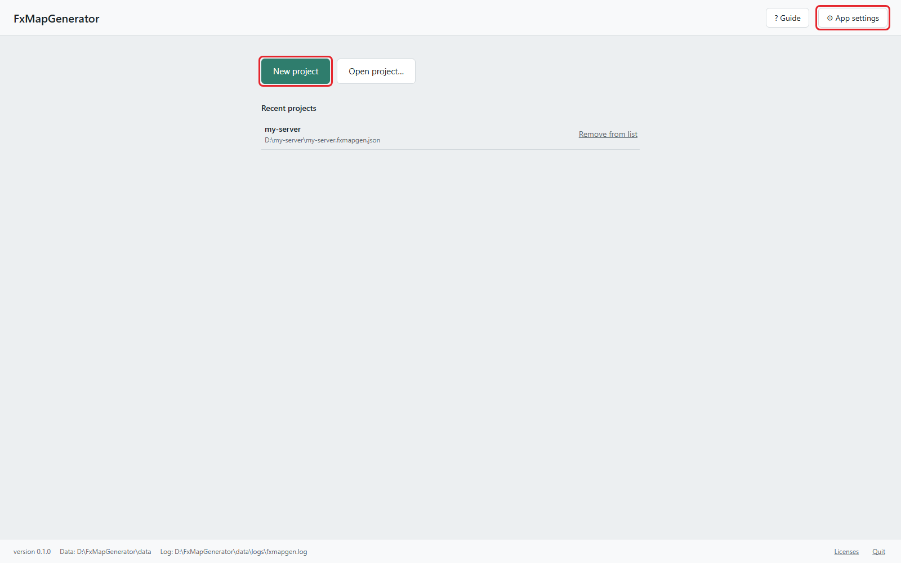
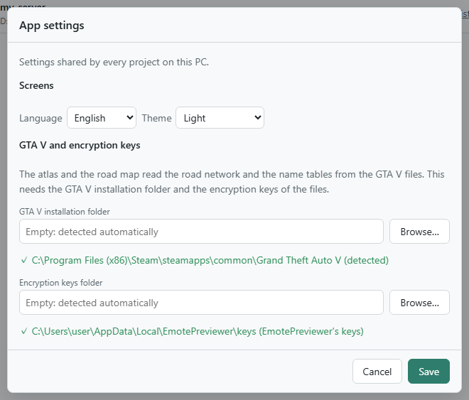
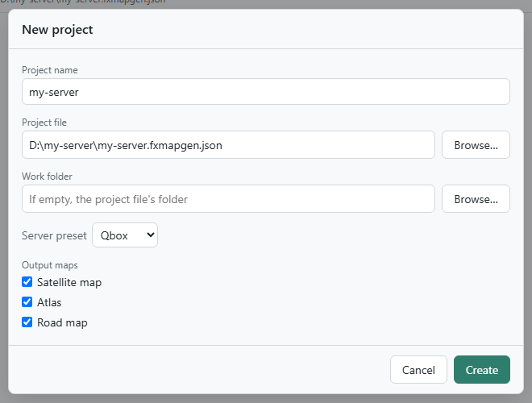
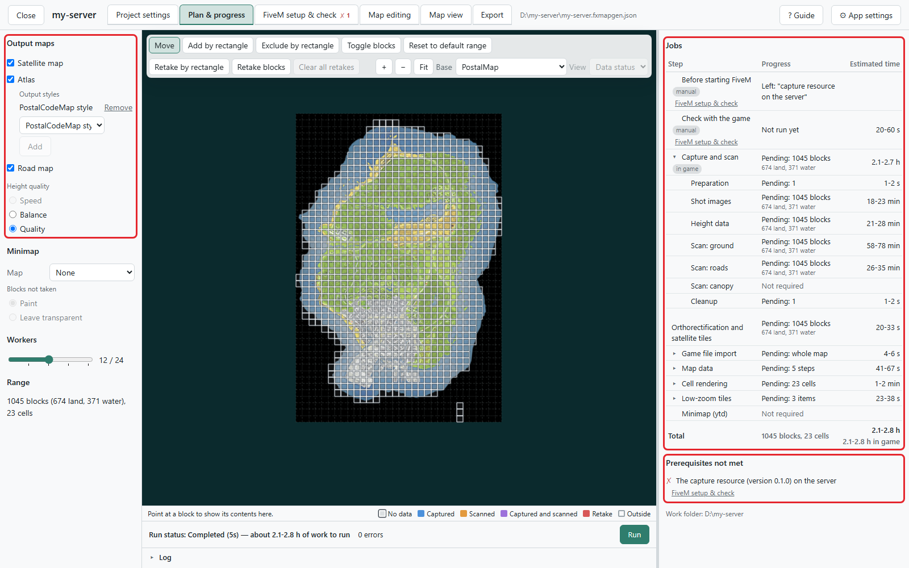
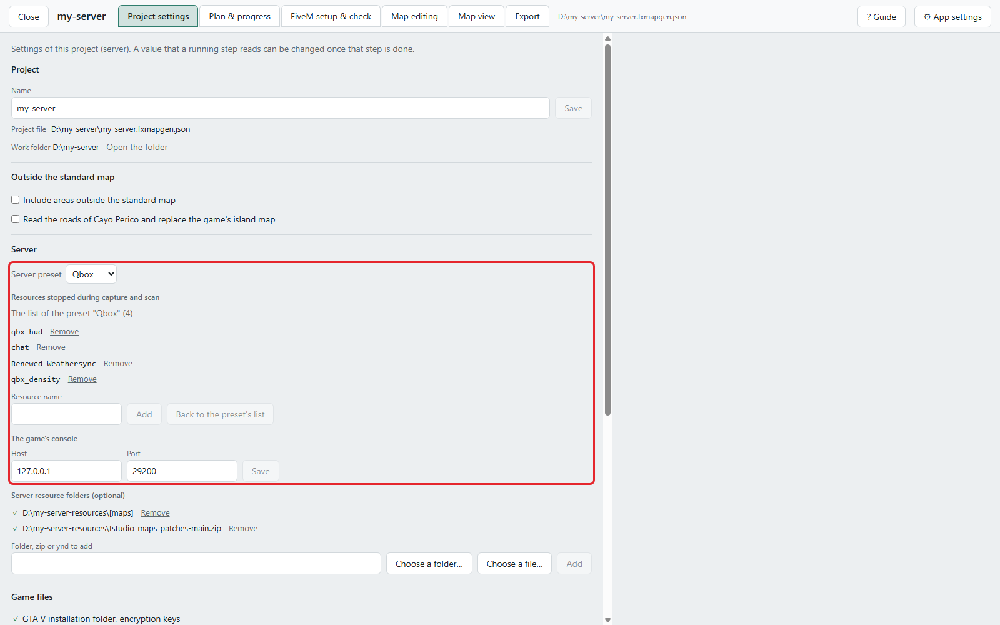
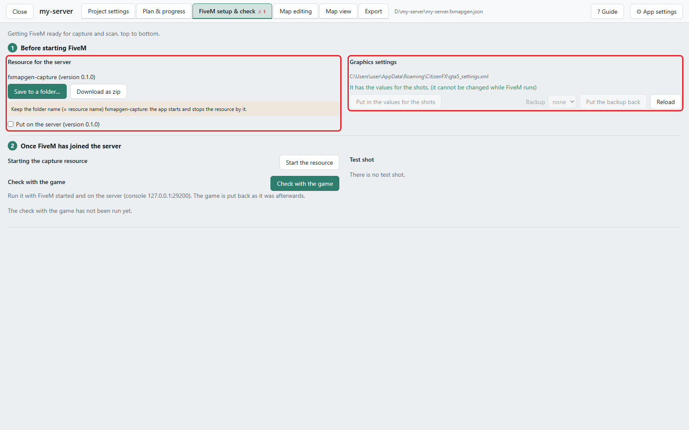
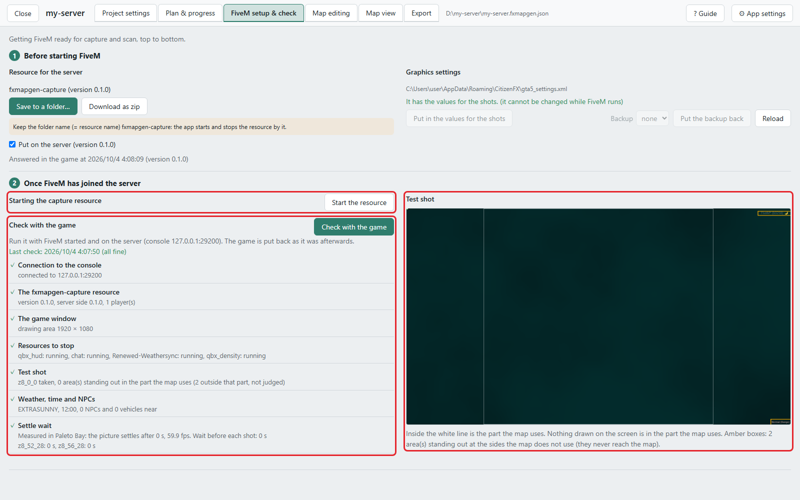
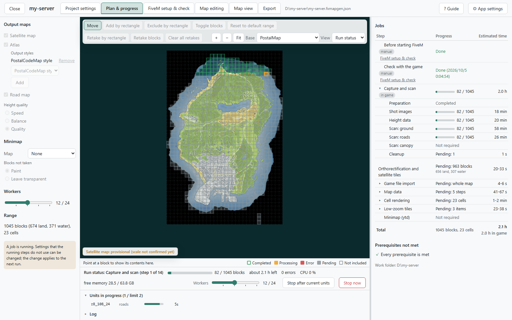
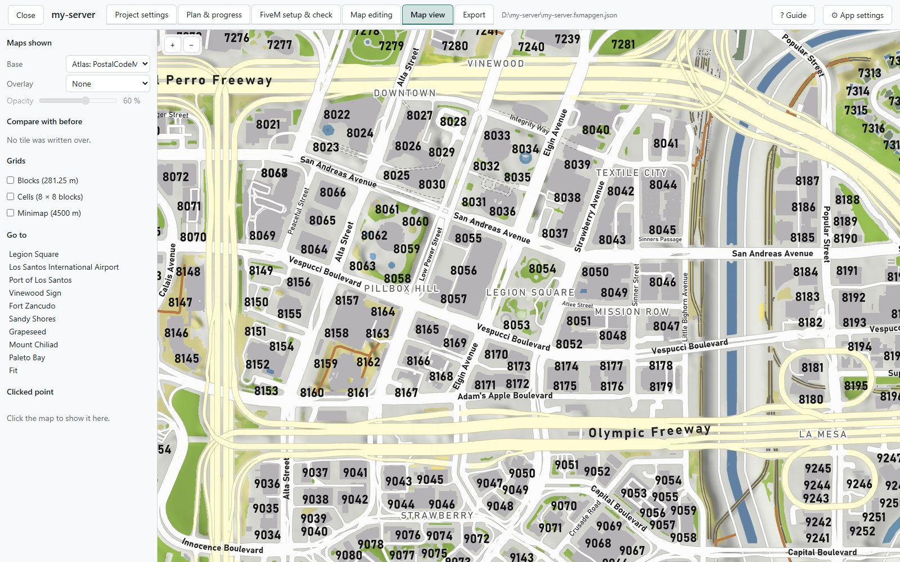
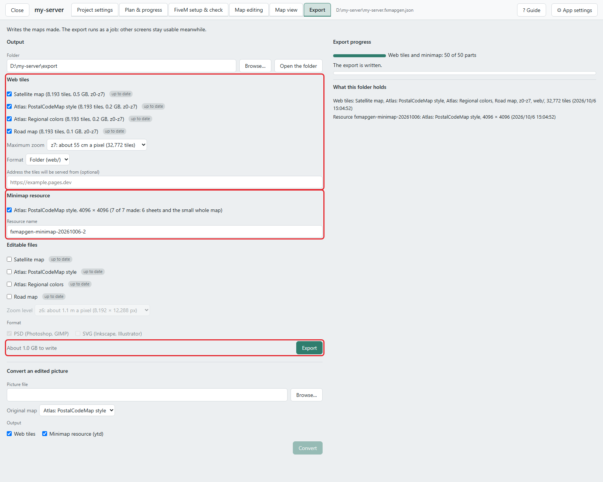

# Your first map

English | [日本語](walkthrough.ja.md)

From downloading FxMapGenerator to making the maps and putting them into the game and onto the web, step by step.

The maps made here are the satellite, atlas and road maps of GTA V's standard map (the default range). Land outside the
standard map such as Cayo Perico, Japanese maps and updating a map are in [Questions and answers](faq.md). For the
details of a screen, see [The screens](screens.md).

## The whole way

| # | What you do | Where |
|---|---|---|
| 1 | Get ready (the keys, the server, the time) | — |
| 2 | Download and start | the start screen |
| 3 | Make a project | **New project** |
| 4 | Choose the maps to make | **Plan & progress** |
| 5 | Check the server's settings | **Project settings** |
| 6 | Prepare FiveM | **FiveM setup & check** |
| 7 | Run (capture and scan, then the maps) | **Plan & progress** |
| 8 | Look at the maps | **Map view** |
| 9 | Export | **Export** |
| 10 | Put them in place (the in-game map, the web map) | the server, a web host |
| 11 | Tidy up | **FiveM setup & check** |

The game is needed only for step 6 and the first half of step 7 (capture and scan). Everything else works with the game
closed.

## 1. Get ready

**The PC**

- A Windows PC with GTA V and FiveM. The captures and scans run in the game on this PC.
- Around 10 GB of free space, for the whole map, on the drive that holds the work folder.

**The server**

- You can put the capture resource (it comes inside the app) into the server's `resources`.
- The player who captures (you) has the permission `command.fxmapgen`. An admin who is allowed `command` already has it.
  Starting the resource also uses the permission to send server commands.
- **While capturing, every vehicle and NPC on the server is deleted.** While anyone else is on the server, nothing is
  deleted and the capture refuses. Use a time when nobody else plays, or a copy of the server.

**The encryption keys** (for the atlas and the road map, and for exporting the minimap resource)

Download `EmotePreviewerKeyTool-<version>-win-x64.exe` from the
[EmotePreviewer Key Tool releases](https://github.com/Acc-Off/EmotePreviewerKeyTool/releases) and run it. It reads the
keys from `GTA5.exe` and writes them to `%LOCALAPPDATA%\EmotePreviewer\keys`, where FxMapGenerator finds them by itself.
This is needed only once.

**The time**

How long the game is in use (capture and scan), for the whole map (the 1,045 blocks of the default range). It varies
with the PC and the server, and the game is busy all that time. **Height quality** is chosen in step 4.

| Maps to make | Speed | Balance | Quality |
|---|---|---|---|
| Satellite map only | about 40 min | about 80 min | about 110 min |
| Satellite map, atlas and road map | – | about 110 min | about 140 min |
| Atlas and road map only | – | about 120 min | about 130 min |

After the capture and scan comes the work without the game (making the maps). The screen estimates its time for the
number of workers you choose.

## 2. Download and start

1. Download `FxMapGenerator-<version>-win-x64.exe` from
   [Releases](https://github.com/Acc-Off/FxMapGenerator/releases). It can be put anywhere.
   - `…-slim.exe` is smaller but needs .NET 10's Desktop Runtime and ASP.NET Core Runtime (x64).
2. Run it. It is not code-signed, so Windows SmartScreen may ask once (**More info** → **Run anyway**).
3. The app's console window (a black window) opens, and the start screen opens in your browser
   (`http://127.0.0.1:20400/`).
4. Open **⚙ App settings** and check that both lines under **GTA V and encryption keys** show ✓. Empty fields are
   detected automatically. On a ✗, follow the reason shown and give the folder.

<p align="center">
  
  <br>
  <em>Red frames: "New project" and "⚙ App settings"</em>
</p>

<p align="center">
  
  <br>
  <em>The "⚙ App settings" window. With ✓ on GTA V and on the encryption keys, you are ready</em>
</p>

The first time you open a screen, a box at the bottom right asks whether to show that screen's guide (**Show**,
**Later**, **Don't ask again**). **? Guide** in the header shows it at any time. Hover over an item on a screen to read
what it does.

Closing the browser tab leaves the app running. To end the app, press **Quit** at the bottom of the screen.

## 3. Make a project

A project is the settings and the data for the maps of one server.

1. Press **New project**.
2. Fill in the following. All of it can be changed later.
   - **Project name**: the name shown on the screens.
   - **Project file**: the file the settings are saved in (`.fxmapgen.json`). Example:
     `D:\my-server\my-server.fxmapgen.json`
   - **Work folder**: the folder for the captures and the tiles. Left empty, it is the project file's folder.
   - **Server preset**: Qbox or QBCore. It decides, among other things, the resources stopped during capture and scan.
   - **Output maps**: satellite map, atlas, road map.
3. Press **Create**. The **Plan & progress** screen opens.

<p align="center">
  
</p>

## 4. Choose the maps to make (Plan & progress)

**Plan & progress** is where you decide the maps and the range, run, and watch the progress. The settings are on the
left, the map in the middle and the **Jobs** list on the right.

<p align="center">
  
  <br>
  <em>Red frames: "Output maps" on the left, "Jobs" at the top right, "Prerequisites not met" at the bottom right</em>
</p>

Go through the left panel from the top.

- **Output maps**: the maps to make. For the atlas, each line under **Output styles** is one map (the bundled styles
  are "PostalCodeMap style" and "Regional colors").
- **Height quality**: time against finish (the table in step 1). Hover over the item to read the differences.
- **Minimap**: choose the map that becomes the in-game map under **Map**.
- **Workers**: how many units are worked on at the same time in the work without the game. It can be changed during a
  run too.
- **Range**: at first the default range (1,045 blocks: the land and the water near it). Leave it as it is here.

As you choose, the **Jobs** list on the right shows the work left and the estimated time. Rows marked "in game" are the
work that uses FiveM.

**Prerequisites not met** on the right lists what has to be done before a run. At this point the items about FiveM are
left; the next two steps take care of them.

## 5. Check the server's settings (Project settings)

Open the **Project settings** tab and look at the **Server** section.

- **Resources stopped during capture and scan**: resources that show in the photographs or affect the rendering, such
  as the HUD, notifications and chat. At first it is the preset's list. The app starts them again when the capture and
  scan are over. If other resources of your server put something on the screen, add them here (the test shot in step 6
  shows what still gets into the picture).
- **The game's console**: normally left at `127.0.0.1:29200`. The game's console is the FiveM client's console (the
  one F8 opens in the game), not the server's console. The app drives the game through it.

If your server ships road data of its own (`.ynd`), add those resources' folders, zips or ynd files under **Server
resource folders**. If it does not, leave the list empty.

<p align="center">
  
  <br>
  <em>Red frame: the "Server" section</em>
</p>

## 6. Prepare FiveM (FiveM setup & check)

Open the **FiveM setup & check** tab and go from top to bottom.

<p align="center">
  
  <br>
  <em>Red frames: "Resource for the server" on the left, "Graphics settings" on the right</em>
</p>

### Before starting FiveM

1. **Resource for the server**: put the capture resource `fxmapgen-capture` into the server's `resources`.
   - If the server is on this PC or on a shared folder, choose the server's `resources` with **Save to a folder…**.
   - If the server is somewhere else, take the resource with **Download as zip**, unpack it into the server's
     `resources`, and tick **Put on the server**.
   - Keep the folder name `fxmapgen-capture`. There is no need to write it into `server.cfg` (the app starts it
     through the game's console).
2. **Graphics settings**: with FiveM closed, press **Put in the values for the shots**. This sets the game window
   (windowed, 1920×1080) and the quality to the values the shots need. The file as it was is kept and can be put back
   later (step 11).

### Once FiveM has joined the server

3. Start FiveM and join the server. Close other tools that use the game's console (FxDeck, for example): only one
   program can use the game's console at a time.
4. **Starting the capture resource**: press **Start the resource**. The app sends `refresh` and
   `ensure fxmapgen-capture` through the game's console (up to about 20 seconds).
5. **Check with the game**: press **Check with the game**. It takes about 15 seconds; do not touch the game meanwhile.
   Seven items are checked (the connection to the game's console, the resource, the game window, the resources to stop,
   the test shot, weather, time and NPCs, the settle wait), and an item with ✗ says how to fix it.
6. **Test shot**: the photograph the check took. The part inside the white lines is what the map uses. Red frames are
   things on the screen that got into the picture: add the resource that shows them to **Resources stopped during
   capture and scan** on **Project settings** and check again.

<p align="center">
  
  <br>
  <em>Red frames: "Start the resource" at the top left, the result of the check below it, "Test shot" on the right</em>
</p>

When everything shows ✓, **Prerequisites not met** on **Plan & progress** turns into "Every prerequisite is met".

## 7. Run (Plan & progress)

Go back to **Plan & progress** and press **Run**. The work left in the job list runs as one job, step after step.

**During the capture and scan (while the game is in use)**

- Do not touch the game. The app moves the camera over block after block, takes the photographs and scans the ground
  and the roads.
- Your character becomes invisible and is held in place, and returns to where it was at the end.
- The map in the middle shows the finished blocks and the block being worked on in colors. The satellite map appears on
  it block by block as the captures come in.

<p align="center">
  
  <br>
  <em>During the capture and scan: the satellite map appears block by block</em>
</p>

**Stopping and going on**

- **Stop after current units** stops once the block being worked on is finished. **Stop now** stops at once.
- Either way, the next **Run** goes on from where it stopped, so the work can be spread over several days.
- The run goes on when the browser is closed. Start the exe again or open `http://127.0.0.1:20400/` to get back to
  the screens.

**When the capture and scan are over**

- The screen says "The work in the game is done. FiveM and the server can be closed." The app stops the capture
  resource and starts the resources it had stopped again.
- The rest of the work (orthorectification, map data, cell rendering, low-zoom tiles, the minimap) goes on without the
  game, as many units at a time as there are workers, and the map shows it.

<p align="center">
  
  <br>
  <em>Making the maps: as many cells are drawn at the same time as there are workers</em>
</p>

When nothing is left in the job list, the maps are finished.

## 8. Look at the maps (Map view)

The **Map view** tab shows the maps you made. They are the same tiles the export writes.

- Under **Maps shown**, choose the base map, the overlay and the overlay's opacity. The atlas laid half transparent
  over the satellite map makes shifts and gaps easy to find.
- **Go to** jumps to the main places.
- Click the map to see the values of that point (block, material, height, zone, street name and more) on the left.

<p align="center">
  
</p>

Worth a look:

- **Is a notification in the satellite map?** A notification on screen at the moment of a shot can end up in the
  photograph. Mark such a block for retake on the **Plan & progress** map and run: only that block is captured again
  ([Questions and answers](faq.md#a-notification-is-in-a-photograph)).
- **Are the roads and bridges of your MLOs drawn?** A road of an MLO that ships no road data is drawn as ground and
  buildings, not as a road. Draw it in **Map editing** → **Roads** ([The screens](screens.md#roads)).

## 9. Export (Export)

Open the **Export** tab.

1. **Output**: the folder to export into. At first it is `export` beside the project file.
2. **Web tiles**: tick the maps to export and choose the maximum zoom.
   - Each zoom level less leaves about a quarter of the files (the whole satellite map is 32,769 files up to z8, 8,193
     up to z7 and 2,049 up to z6). For a host that limits the files of a site (Cloudflare Pages: 20,000 on the free
     plan), choose z7.
   - **Address the tiles will be served from**: fill it in if you already know the web server's address. It goes into
     the lb-phone example.
3. **Minimap resource**: tick it and look at the resource name. At first it is a name with the date.
4. Press **Export**.

<p align="center">
  
  <br>
  <em>Red frames, from the top: "Web tiles", "Minimap resource", the "Export" button</em>
</p>

Further down the screen, **Editable files** and **Convert an edited picture** are for working on a map in a paint
program. For your first map, leave them as they are. The steps for editing a map are in
[Questions and answers](faq.md#editing-a-map-in-photoshop-or-gimp-psd).

The export folder then holds:

```
export/
  web/                          the web map
    index.html                  the viewer (opens straight from the disk)
    tiles/<map>/{z}/{x}/{y}.png
    lb-phone.lua                the example entry for lb-phone
    README.txt, CREDITS.txt
  fxmapgen-minimap-<date>/      the resource of the in-game map
    README.txt                  how to install it
    …
```

## 10. Put them in place

### The in-game map

1. Put the folder `fxmapgen-minimap-<date>` into the server's `resources`.
2. Add `ensure fxmapgen-minimap-<date>` to `server.cfg` (from the server console: `refresh`, then `ensure`).
3. Remove what this resource replaces:
   - postal-code-map (PostalCodeMap) and other minimap resources
   - an Extra Map Tiles resource you already run (this resource brings its own)
4. Start FiveM again. The radar keeps the pictures it read when the game started, so joining the server again is not
   enough. Your players, too, see the new map after they start FiveM again.

The same is in the resource's own `README.txt`.

When you make the maps again, replace the resource with one exported under a new name: FiveM keeps the files of a
resource of the same name on the players' PCs.

### The web map

- **Just to look at it**: open `web/index.html` in a browser.
- **To publish it**: put the contents of the `web` folder on a static web host as they are. The tile address is
  `<host>/tiles/<map>/{z}/{x}/{y}.png`.
- **To use it in lb-phone**: add the contents of `web/lb-phone.lua` to `Config.CustomMaps` in lb-phone's
  `config/config.lua`. Check that it holds the address you serve the tiles from.

<p align="center">
  
</p>

`CREDITS.txt` names where the parts of the exported maps come from. Keep it with the map when you publish it.

## 11. Tidy up

- **Put the graphics settings back**: close FiveM, and under **Graphics settings** on **FiveM setup & check** choose
  the file from before the change under **Backup** and press **Put the backup back**.
- **The capture resource**: once the capture and scan have run to the end, the app has stopped it. Its folder stays on
  the server; leave it there, the next capture (an update of the maps) uses it again. Delete it when you no longer need
  it.
- **Ending the app**: press **Quit** at the bottom of the screen.

## What next

- You added an MLO to the server → [Updating the maps after the server changed](faq.md#updating-the-maps-after-the-server-changed)
- You want other colors or text, or markers on the map → [The screens: Map editing](screens.md#map-editing)
- You want to finish a map in a paint program →
  [Editing a map in Photoshop or GIMP (PSD)](faq.md#editing-a-map-in-photoshop-or-gimp-psd),
  [Editing a map in Inkscape or Illustrator (SVG)](faq.md#editing-a-map-in-inkscape-or-illustrator-svg)
- You want Cayo Perico on the map too → [Cayo Perico, Roxwood and other land outside the standard map](faq.md#cayo-perico-roxwood-and-other-land-outside-the-standard-map)
- You want Japanese maps as well → [Japanese maps](faq.md#japanese-maps)
