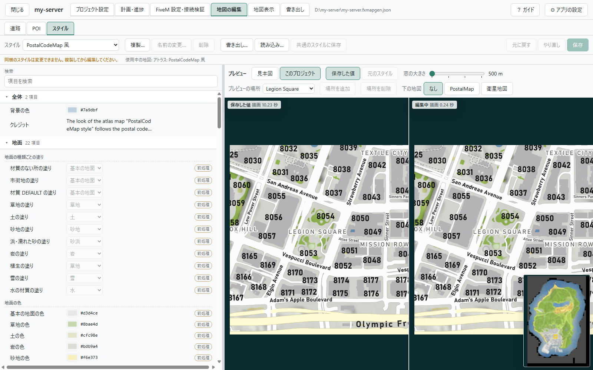
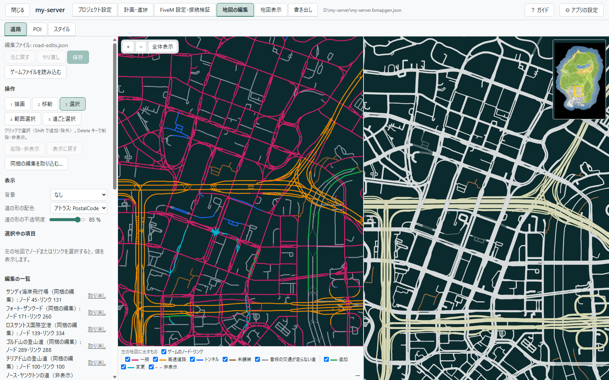
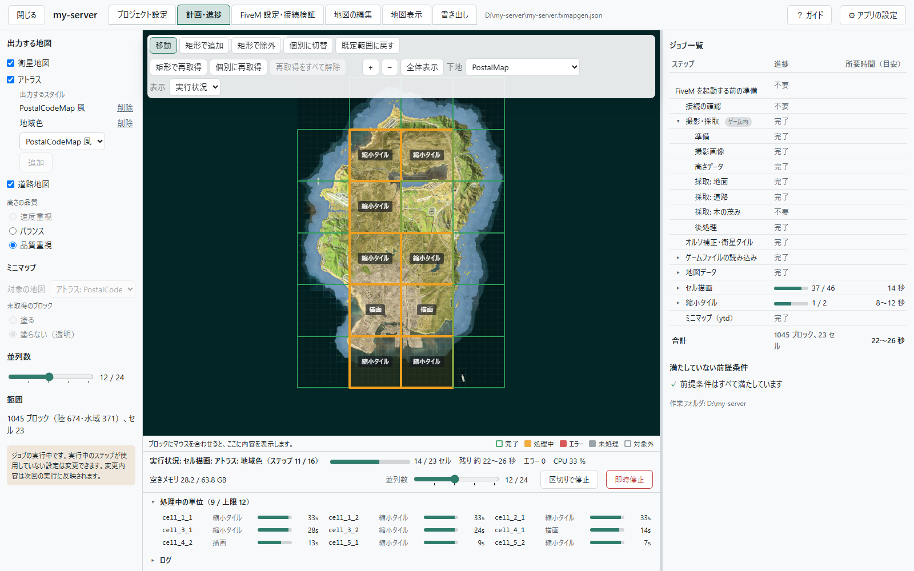

# FxMapGenerator

**FiveM サーバーの今のワールドから、衛星地図・アトラス地図・道路地図を作る Windows ツール。**

[English](README.md) | 日本語

MLO を入れたのに、地図は元の GTA V のまま。それをなくすツールです。あなたのサーバーのワールドをゲームの中から撮影して
地図を作り、ゲーム内のミニマップと Web 地図に書き出します。exe 1 つで、インストールは不要です。

<p align="center">
  
</p>

## できること

### サーバーの今の姿が、そのまま地図になる

入れた MLO、変えた地形、追加した島（カヨ・ペリコ、Roxwood など）が、地図に出ます。地図の元は、あなたのサーバーに
接続したゲームの中の、今のワールドです。

### 地図は 3 種類

- **衛星地図**: 真上から撮影した写真を、測った高さで位置を合わせてつないだ地図です。
- **アトラス地図**: 地面の種類、水深、建物、道、通り名、地区名、郵便番号を描いた地図です。同梱のスタイルは
  「PostalCodeMap 風」と「地域色」の 2 つで、自分のスタイルも作れます。
- **道路地図**: 道と通り名を中心にした地図です。

### ゲームの中でも、Web でも使える

- **ゲーム内の地図**: レーダーと ESC の地図を、作成した地図に置き換えるリソースを 1 つ書き出します。サーバーの
  `resources` に置いて `ensure` するだけです。
- **Web 地図**: 256 px のタイルと、ファイルのまま開けるビューア、lb-phone の設定例を書き出します。

<p align="center">
  
</p>

### 見た目も中身も、画面で直せる

- **スタイル**: アトラス地図の色、線の太さ、文字、フォントを、プレビューを見ながら変えられます。
- **道路**: 道のデータを持たない MLO の道や橋を描き足せます。要らない道は非表示にできます。
- **POI**: 地図に目印（文字、丸、アイコン）を置けます。CSV・JSON からまとめて読み込めます。

<p align="center">
  
  
</p>

### 仕上げは、使い慣れた画像編集ソフトで

作成した地図を、レイヤーに分けた PSD・SVG のファイルで書き出せます。Photoshop・GIMP・Inkscape などで手を加えた画像は、
ゲーム内の地図と Web 地図に変換できます。

### 撮影から地図の作成まで、アプリが進める

操作はブラウザの画面で行います。作る地図と範囲を選んで「実行」を押すと、アプリがゲームを操作して、ブロックごとに
撮影と地面・道の採取を行い、続けて地図を作成します。所要時間は、実行の前に見積もりが出ます。途中で停止しても、
次の実行は続きから始まります。

<p align="center">
  
</p>

### サーバーが変わったら、変わった所だけ取り直す

MLO を追加したときは、その場所のブロックに再取得の印を付けて実行します。ゲームではそのブロックだけを取り直し、
地図は関係する所だけを作り直します。変更前の地図と重ねて比較できます。

## 必要なもの

- **GTA V と FiveM の入った Windows の PC。** 撮影と採取は、この PC のゲームで行います。全域の撮影・採取は、作る地図に
  よって 40 分〜2 時間 20 分ほどかかり、その間はゲームを使えません。作業フォルダには、全域で 10 GB 前後の空きが要ります。
- **撮影用のリソースを置けるサーバー。** リソースはアプリに同梱しています。撮影するプレイヤーには権限
  `command.fxmapgen` が要ります（管理者はたいてい持っています。[リソースの README](resource/fxmapgen-capture/README.ja.md)）。
  **撮影の間、サーバーの車と NPC をすべて消します**（ほかのプレイヤーがいるときは撮影を断ります）。ほかに誰もいない
  時間か、複製したサーバーで行ってください。
- **GTA V のファイルの暗号鍵**（アトラス地図と道路地図を作るときと、ミニマップ用のリソースを書き出すとき）。
  [EmotePreviewer Key Tool](https://github.com/Acc-Off/EmotePreviewerKeyTool) で作ります。

## はじめかた

1. [Releases](https://github.com/Acc-Off/FxMapGenerator/releases) から `FxMapGenerator-<version>-win-x64.exe` を
   ダウンロードして実行します。コード署名をしていないため、Windows SmartScreen が確認を出すことがあります（「詳細情報」→
   「実行」）。アプリのコンソールウィンドウ（黒いウィンドウ）が開き、ブラウザで画面（`http://127.0.0.1:20400/`）が
   開きます。
   - `…-slim.exe` は小さい代わりに、.NET 10 の **Desktop Runtime** と **ASP.NET Core Runtime**（x64）が必要です。
2. 「新規プロジェクト」で、プロジェクト名と作る地図を選びます。
3. ここから先は、[はじめての地図](Docs/walkthrough.ja.md) に、ゲームに配置するまでを順に書いてあります。

## 文書

| 文書 | 中身 |
|---|---|
| [はじめての地図](Docs/walkthrough.ja.md) | ダウンロードから、地図を作ってゲームと Web に配置するまでの手順 |
| [画面ごとの説明](Docs/screens.ja.md) | それぞれの画面で何をするか。地図の編集（道路・POI・スタイル）もここ |
| [よくある質問](Docs/faq.ja.md) | 地図の更新、カヨ・ペリコなどの手順と、うまくいかないときの対処 |
| [撮影用リソース](resource/fxmapgen-capture/README.ja.md) | サーバーに置くリソースの権限と、サーバーに対して行うこと |
| [開発の手引き](Docs/development.ja.md) | 構成、ビルド、コマンドライン。API は [Docs/api.ja.md](Docs/api.ja.md)、ファイルの形式は [Docs/spec/](Docs/spec/) |

画面にも説明があります。画面ごとの短いガイド（上の帯の「？ ガイド」）と、項目にマウスを乗せると出る解説です。

## ソースからのビルド

必要なもの: .NET SDK 10、Node.js 22 以降。

```
dotnet build FxMapGenerator.slnx -c Release
dotnet test FxMapGenerator.slnx -c Release
```

詳しくは [Docs/development.ja.md](Docs/development.ja.md)。

## 免責

FxMapGenerator は個人のプロジェクトです。Rockstar Games、Take-Two Interactive、Cfx.re（FiveM）とは無関係で、承認も
受けていません。あなたが所有するゲームと、あなたのサーバーから地図を作るツールで、ゲームのファイルと暗号鍵は含みません。

## ライセンス

MIT。[LICENSE](LICENSE) と [THIRD-PARTY-NOTICES.md](THIRD-PARTY-NOTICES.md) を見てください。
