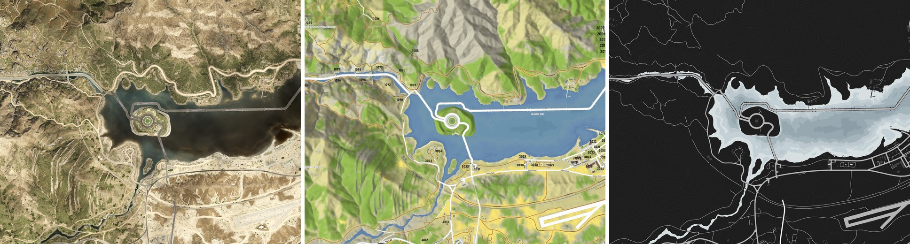
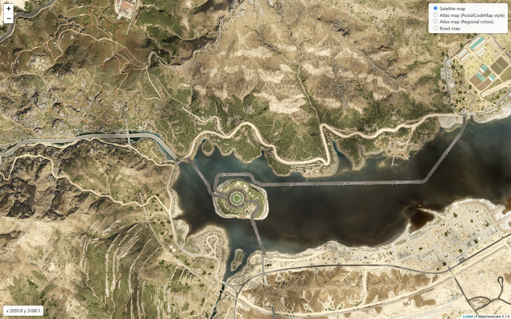
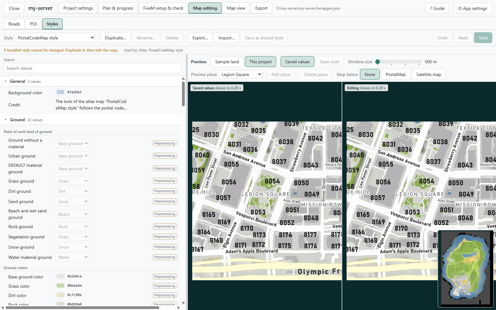
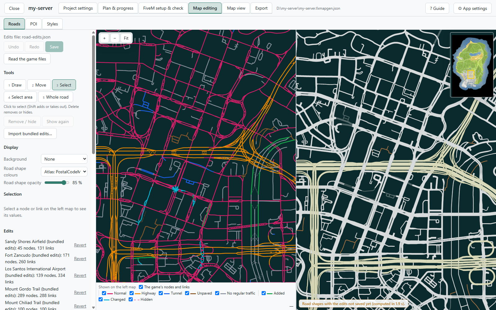
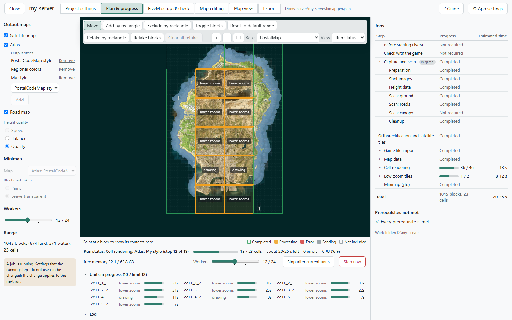

# FxMapGenerator

**A Windows tool that makes satellite, atlas and road maps of your FiveM server's world as it is today.**

English | [日本語](README.ja.md)

You added MLOs, and the map still shows the original GTA V. This tool ends that: it photographs your server's world from
inside the game, makes maps of it, and exports them as the in-game minimap and as a web map. One exe, nothing to install.

<p align="center">
  
</p>

## What it does

### Your server as it is today becomes the map

The MLOs you installed, the terrain you changed and the islands you added (Cayo Perico, Roxwood and others) show on the
maps. The maps are made from the world the game shows while it is connected to your server.

### Three kinds of maps

- **Satellite map**: photographs taken straight down, put in place with the measured heights and joined.
- **Atlas map**: ground types, water depth, buildings, roads, street names, zone names and postal codes. Two styles come
  with the app, "PostalCodeMap style" and "Regional colors", and you can make your own.
- **Road map**: a map of the roads and their street names.

### In the game and on the web

- **In-game map**: one resource that replaces the radar and the pause map with the map you made. Put it into the
  server's `resources` and `ensure` it.
- **Web map**: 256 px tiles, a viewer that opens straight from the disk, and an example entry for lb-phone.

<p align="center">
  
</p>

### Change the look and the content on screen

- **Styles**: change the atlas map's colors, line widths, text and fonts while watching a preview.
- **Roads**: draw the roads and bridges of an MLO that ships no road data, and hide the roads you do not want.
- **POI**: put markers (text, circles, icons) on the map, or import them from CSV and JSON.

<p align="center">
  
  
</p>

### Finish it in the editor you already use

Write a map as a layered PSD or SVG file, work on it in Photoshop, GIMP or Inkscape, and turn the edited picture into
the in-game map and the web map.

### The app takes it from the captures to the finished maps

You work on screens in your browser. Choose the maps and the range and press **Run**: the app drives the game, captures
and scans the ground and the roads block by block, and goes on to make the maps. The time is estimated before you
start. A run you stop goes on from where it was the next time.

<p align="center">
  
</p>

### When the server changes, retake only what changed

After adding an MLO, mark the blocks there for retake and run. The game captures only those blocks and the maps are
made again only where they depend on them. The new map can be laid over the map before for comparison.

## What you need

- **A Windows PC with GTA V and FiveM.** The captures and scans run in the game on this PC. The whole map takes about
  40 minutes to 2 hours 20 minutes, depending on the maps you make, and the game is busy all that time. The work folder
  needs around 10 GB of free space for the whole map.
- **A server you can put the capture resource on.** The resource comes inside the app. The player who captures needs
  the permission `command.fxmapgen`, which admins usually have (see the
  [resource's README](resource/fxmapgen-capture/README.md)). **While capturing, every vehicle and NPC on the server is
  deleted** (the capture refuses while anyone else is on the server). Use a time when nobody else plays, or a copy of
  the server.
- **The encryption keys of GTA V's files** (for the atlas and the road map, and for exporting the minimap resource),
  made with [EmotePreviewer Key Tool](https://github.com/Acc-Off/EmotePreviewerKeyTool).

## Getting started

1. Download `FxMapGenerator-<version>-win-x64.exe` from [Releases](https://github.com/Acc-Off/FxMapGenerator/releases)
   and run it. It is not code-signed, so Windows SmartScreen may ask once (**More info** → **Run anyway**). The app's
   console window (a black window) opens, and the screens open in your browser (`http://127.0.0.1:20400/`).
   - `…-slim.exe` is smaller but needs .NET 10's **Desktop Runtime** and **ASP.NET Core Runtime** (x64).
2. **New project**: give it a name and choose the maps to make.
3. From here, [Your first map](Docs/walkthrough.md) goes step by step to the maps in the game.

## Documents

| Document | What it holds |
|---|---|
| [Your first map](Docs/walkthrough.md) | From the download to the maps in the game and on the web, step by step |
| [The screens](Docs/screens.md) | What each screen is for, the map editors (roads, POI, styles) included |
| [Questions and answers](Docs/faq.md) | Updating a map, Cayo Perico and other how-tos, and what to do when something fails |
| [The capture resource](resource/fxmapgen-capture/README.md) | The permission the resource needs and what it does to the server |
| [Development guide](Docs/development.md) | Layout, building, the command line. The API is in [Docs/api.md](Docs/api.md), the file formats in [Docs/spec/](Docs/spec/) (Japanese) |

The screens explain themselves too: every screen has a short guide (**? Guide** in the header), and hovering over an
item shows what it does.

## Building from source

Requirements: .NET SDK 10, Node.js 22 or later.

```
dotnet build FxMapGenerator.slnx -c Release
dotnet test FxMapGenerator.slnx -c Release
```

See [Docs/development.md](Docs/development.md).

## Disclaimer

FxMapGenerator is a personal project. It is not affiliated with or endorsed by Rockstar Games, Take-Two Interactive or
Cfx.re (FiveM). It makes maps from the game you own and from your own server, and contains no game files and no
encryption keys.

## License

MIT. See [LICENSE](LICENSE) and [THIRD-PARTY-NOTICES.md](THIRD-PARTY-NOTICES.md).
